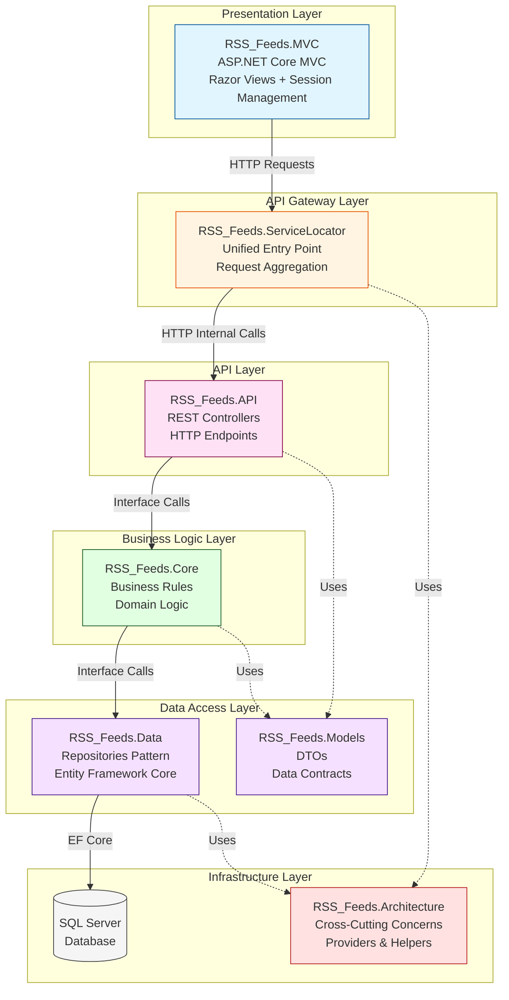
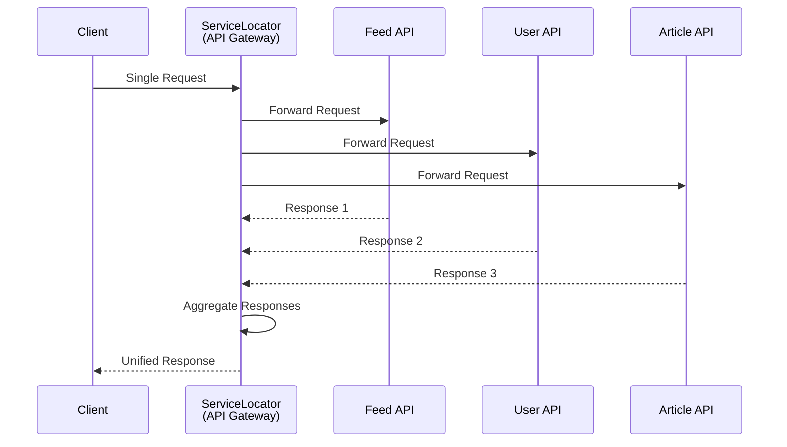
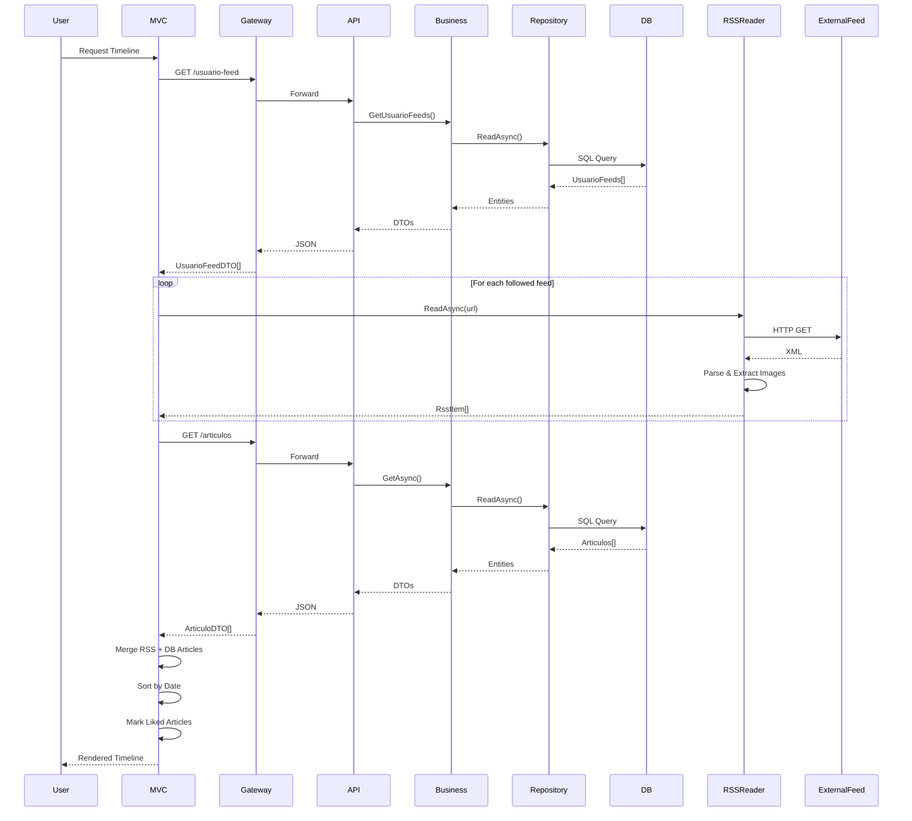
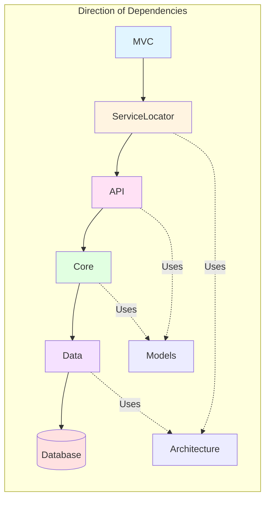

# RSS Feeds - Documentación Arquitectónica

## 🎯 Introducción

**RSS Feeds** es una aplicación agregadora de feeds RSS construida con **.NET 8.0** que demuestra una arquitectura empresarial sólida, implementando múltiples patrones de diseño avanzados y mejores prácticas de la industria.

Este documento presenta una visión arquitectónica del proyecto, destacando las decisiones técnicas, patrones de diseño implementados y cómo se logra una separación clara de responsabilidades mediante una arquitectura en capas bien definida.

---

## 🏛️ Arquitectura Empresarial

### Visión General de la Arquitectura

El proyecto implementa una **Arquitectura en Capas (Layered Architecture)** con separación estricta de responsabilidades, siguiendo los principios de **Clean Architecture** y **Domain-Driven Design (DDD)**.



### Decisiones Arquitectónicas Clave

#### 1. Separación en 7 Proyectos

**Razón**: Permite:
- **Independencia de despliegue**: Cada capa puede escalarse independientemente
- **Mantenibilidad**: Cambios aislados por capa
- **Testabilidad**: Fácil creación de mocks y tests unitarios
- **Reutilización**: Componentes compartidos en Architecture layer

#### 2. API Gateway Pattern

**Razón**: 
- **Simplificación del cliente**: MVC solo conoce un único endpoint
- **Abstracción de complejidad**: Encapsula múltiples APIs internas
- **Agregación**: Combina respuestas de múltiples servicios
- **Cross-cutting concerns**: Lugar centralizado para logging, autenticación, rate limiting

#### 3. Repository Pattern + Business Logic Layer

**Razón**:
- **Abstracción de datos**: La lógica de negocio no depende de Entity Framework directamente
- **Testabilidad**: Fácil mock de repositorios en tests
- **Flexibilidad**: Posibilidad de cambiar ORM sin afectar business logic
- **Single Responsibility**: Cada capa tiene una responsabilidad clara

---

## 🎨 Patrones de Diseño Implementados

### 1. Repository Pattern

**Implementación**: Clase base genérica con especializaciones específicas por entidad.

```csharp
// Base genérica reutilizable
public abstract class RepositoryBase<T> : IRepositoryBase<T> where T : class
{
    protected readonly RssDbContext _context;
    protected DbSet<T> DbSet;

    public async Task<bool> CreateAsync(T entity)
    {
        await _context.AddAsync(entity);
        return await SaveAsync();
    }
    // Operaciones CRUD genéricas...
}

// Especialización por entidad
public class RepositoryFeed : RepositoryBase<Feed>, IRepositoryFeed
{
    // Operaciones específicas de Feed
    public async Task<bool> CheckBeforeSavingAsync(Feed entity)
    {
        if (string.IsNullOrWhiteSpace(entity.Url))
            return false;
        // Validaciones específicas...
    }
}
```

**Beneficio**: Elimina duplicación de código CRUD, manteniendo flexibilidad para operaciones específicas.

### 2. API Gateway Pattern

**Implementación**: ServiceLocator actúa como punto de entrada único.



**Beneficio**: Cliente simplificado, agregación de servicios, y punto único para cross-cutting concerns.

### 3. Dependency Injection Pattern

**Implementación**: Inyección mediante Primary Constructors (C# 12) y contenedor nativo de .NET.

```csharp
// Configuración centralizada
builder.Services.AddScoped<IRepositoryFeed, RepositoryFeed>();
builder.Services.AddScoped<IFeedBusiness, FeedBusiness>();

// Uso simplificado con Primary Constructors
public class FeedBusiness(IRepositoryFeed repo) : IFeedBusiness
{
    private readonly IRepositoryFeed _repo = repo;
    // ...
}
```

**Beneficio**: Desacoplamiento total, facilita testing, y gestión automática de ciclo de vida.

### 4. DTO Pattern (Data Transfer Object)

**Razón**: Separación entre modelo de dominio y modelo de transferencia.

```csharp
// Entidad de dominio (interna)
public class Feed
{
    public int Id { get; set; }
    public string Url { get; set; }
    // Propiedades de navegación EF...
}

// DTO (externa)
public class FeedDTO
{
    public int Id { get; set; }
    public string Url { get; set; }
    // Sin propiedades de navegación
}
```

**Beneficio**: Control de exposición de datos, evita serialización cíclica, permite versionado.

### 5. Service Layer Pattern

**Implementación**: Dos niveles de servicios:
- **Business Services** (Core): Lógica de negocio
- **Application Services** (ServiceLocator): Orquestación HTTP

```csharp
// Business Service - Lógica de dominio
public class FeedBusiness : IFeedBusiness
{
    public Task<bool> SaveAsync(Feed entity)
        => _repo.CheckBeforeSavingAsync(entity);
}

// Application Service - Orquestación HTTP
public class FeedService : IFeedService
{
    public async Task<IEnumerable<FeedDTO>> GetDataAsync()
    {
        var url = configuration.GetStringFromAppSettings("APIS", "Feed");
        var response = await restProvider.GetAsync(url, null);
        return await JsonProvider.DeserializeAsync<IEnumerable<FeedDTO>>(response);
    }
}
```

**Beneficio**: Separación clara entre lógica de negocio y orquestación de servicios.

### 6. Provider Pattern

**Implementación**: Abstracción de operaciones técnicas (HTTP, JSON).

```csharp
public interface IRestProvider
{
    Task<string> GetAsync(string endpoint, string? id);
    Task<string> PostAsync(string endpoint, string content);
}

public class RestProvider : IRestProvider
{
    // Implementación HTTP...
}
```

**Beneficio**: Intercambiabilidad, testabilidad, y encapsulación de complejidad técnica.

---

## 🛠️ Stack Tecnológico y Decisiones

### .NET 8.0 - Elección Estratégica

**Características Avanzadas Utilizadas**:

#### Primary Constructors (C# 12)
Simplifica la inyección de dependencias:

```csharp
// Antes (C# 11)
public class FeedBusiness
{
    private readonly IRepositoryFeed _repo;
    public FeedBusiness(IRepositoryFeed repo)
    {
        _repo = repo;
    }
}

// Ahora (C# 12)
public class FeedBusiness(IRepositoryFeed repo) : IFeedBusiness
{
    private readonly IRepositoryFeed _repo = repo;
}
```

**Beneficio**: Código más limpio, menos boilerplate, mejor legibilidad.

#### Nullable Reference Types
Habilitado en todo el proyecto para type safety:

```csharp
public string? Descripcion { get; set; } // Puede ser null
public string Titulo { get; set; } // No puede ser null (compilador verifica)
```

**Beneficio**: Detección temprana de errores de null, mejor documentación del código.

#### Minimal API Configuration
Configuración simplificada sin `Startup.cs`:

```csharp
var builder = WebApplication.CreateBuilder(args);
// Configuración...
var app = builder.Build();
// Pipeline...
```

**Beneficio**: Menos código, más directo, mejor para proyectos pequeños-medianos.

### Entity Framework Core 8.0

**Code-First Approach**:

- Migraciones automáticas
- Fluent API para configuración
- LINQ queries type-safe
- Change tracking automático

**Configuración Avanzada**:

```csharp
modelBuilder.Entity<UsuarioFeed>(entity =>
{
    entity.HasIndex(e => new { e.UsuarioId, e.FeedId })
        .IsUnique(); // Restricción única compuesta
    
    entity.HasOne(d => d.Feed)
        .WithMany(p => p.UsuarioFeeds)
        .OnDelete(DeleteBehavior.ClientSetNull);
});
```

### HttpClient Factory Pattern

**Implementación**: Uso de `IHttpClientFactory` para gestión eficiente de conexiones:

```csharp
builder.Services.AddHttpClient("ApiClient", client =>
{
    client.BaseAddress = new Uri("https://localhost:7094/");
});
```

**Beneficio**: Pool de conexiones, reutilización, mejor manejo de DNS.

---

## 🔄 Flujo de Datos Complejo

### Ejemplo: Flujo del Timeline

El timeline demuestra la complejidad de orquestar múltiples fuentes de datos:



**Desafíos Resueltos**:

1. **Múltiples Fuentes**: Combina datos de BD con feeds RSS externos
2. **Parsing Complejo**: Extrae imágenes de múltiples formatos RSS (enclosure, media:content, media:thumbnail, HTML)
3. **Manejo de Errores**: Si un feed falla, continúa con los demás
4. **Performance**: Lectura asíncrona de múltiples feeds en paralelo
5. **Deduplicación**: Identifica artículos duplicados por URL

---

## 📊 Separación de Responsabilidades

### Diagrama de Dependencias



**Regla**: Las dependencias siempre apuntan hacia adentro. Las capas internas nunca conocen las externas.

### Principios SOLID Aplicados

#### Single Responsibility Principle (SRP)

Cada clase tiene una única razón para cambiar:

- **Repository**: Solo acceso a datos
- **Business**: Solo reglas de negocio
- **Controller**: Solo manejo HTTP
- **Service**: Solo orquestación

#### Dependency Inversion Principle (DIP)

Dependencias hacia abstracciones:

```csharp
// ✅ Depende de interfaz, no de implementación
public class FeedBusiness(IRepositoryFeed repo)

// ❌ NO depende de:
// public class FeedBusiness(RepositoryFeed repo)
```

#### Open/Closed Principle (OCP)

Extensible sin modificar:

- `RepositoryBase<T>` permite agregar nuevos repositorios sin modificar código existente
- Interfaces permiten múltiples implementaciones

---

## 🚀 Escalabilidad y Mantenibilidad

### Escalabilidad Horizontal

**Arquitectura preparada para escalar**:

1. **API Gateway**: Puede distribuir carga entre múltiples instancias de API
2. **Stateless Services**: Todos los servicios son stateless, facilitando load balancing
3. **Database**: Separación permite escalar BD independientemente

### Mantenibilidad

**Factores que facilitan el mantenimiento**:

1. **Separación de Concerns**: Cambios aislados por capa
2. **Interfaces**: Fácil reemplazo de implementaciones
3. **DTOs**: Contratos claros entre capas
4. **Repository Pattern**: Cambios de ORM sin afectar business logic
5. **Testabilidad**: Cada capa testeable independientemente

### Extensibilidad

**Agregar nuevas funcionalidades es sencillo**:

1. Nueva entidad: Sigue el patrón establecido (Repository → Business → API → ServiceLocator)
2. Nueva regla de negocio: Se agrega en Business Layer sin afectar otras capas
3. Nueva fuente de datos: Se abstrae mediante Repository Pattern

---

## 🧩 Casos de Uso Complejos

### 1. Parsing Avanzado de RSS

**Desafío**: Los feeds RSS tienen múltiples formatos para imágenes.

**Solución**: Lógica compleja de extracción:

```csharp
// Extrae imágenes de:
// 1. Enclosure con type="image"
// 2. Media:content (Yahoo Media RSS)
// 3. Media:thumbnail (BBC, CNN)
// 4. Etiquetas  en HTML
```

**Resultado**: Extracción robusta independiente del formato del feed.

### 2. Timeline en Tiempo Real

**Desafío**: Combinar datos de BD con feeds RSS externos en tiempo real.

**Solución**:
- Lectura asíncrona paralela de múltiples feeds
- Merge inteligente de datos
- Deduplicación por URL
- Manejo de errores sin interrumpir el proceso

### 3. Autenticación con Sesiones

**Desafío**: Manejar autenticación sin tokens JWT.

**Solución**:
- Sesiones del servidor (ASP.NET Session)
- Almacenamiento seguro de UserId en sesión
- Middleware pipeline correctamente configurado
- Timeout configurable

---

## ✅ Mejores Prácticas Demostradas

### 1. Clean Code

- **Nomenclatura clara**: Métodos y clases con nombres descriptivos
- **Métodos pequeños**: Cada método hace una cosa
- **DRY**: Lógica común extraída a métodos reutilizables
- **Comentarios mínimos**: Código autoexplicativo

### 2. Async/Await

Todas las operaciones I/O son asíncronas:

```csharp
public async Task<IEnumerable<Feed>> GetAsync()
    => await _context.Set<Feed>().ToListAsync();
```

### 3. Error Handling

Manejo estructurado por capas:
- **Data Layer**: Captura y re-lanza excepciones
- **Business Layer**: Validaciones y retorno de resultados
- **API Layer**: Códigos HTTP apropiados
- **MVC Layer**: Manejo de errores de usuario

### 4. Configuration Management

Configuración centralizada:
- `appsettings.json` para configuración
- `IConfiguration` para acceso tipo-seguro
- Separación por ambiente (Development, Production)

---

## 🎓 Conocimientos Demostrados

### .NET Core 8.0

- ✅ Primary Constructors (C# 12)
- ✅ Nullable Reference Types
- ✅ Minimal API Configuration
- ✅ Dependency Injection avanzado
- ✅ HttpClient Factory Pattern
- ✅ Entity Framework Core Code-First
- ✅ ASP.NET Core Sessions
- ✅ Middleware Pipeline Configuration

### Arquitectura de Software

- ✅ Layered Architecture
- ✅ Clean Architecture Principles
- ✅ Separation of Concerns
- ✅ Dependency Inversion
- ✅ API Gateway Pattern

### Patrones de Diseño

- ✅ Repository Pattern
- ✅ Service Layer Pattern
- ✅ DTO Pattern
- ✅ Provider Pattern
- ✅ Dependency Injection
- ✅ Template Method Pattern

### Principios SOLID

- ✅ Single Responsibility
- ✅ Open/Closed
- ✅ Liskov Substitution
- ✅ Interface Segregation
- ✅ Dependency Inversion

### Prácticas de Desarrollo

- ✅ Async/Await
- ✅ Error Handling estructurado
- ✅ Code-First Database
- ✅ Configuration Management
- ✅ Clean Code

---

## 📈 Conclusión

Este proyecto demuestra un **dominio sólido de .NET Core 8.0** y **arquitectura de software empresarial**, implementando:

- **Arquitectura escalable** con separación clara de responsabilidades
- **Patrones de diseño avanzados** aplicados correctamente
- **Mejores prácticas de la industria** en cada capa
- **Código mantenible y extensible** siguiendo principios SOLID
- **Tecnologías modernas** de .NET 8.0 aprovechadas al máximo

La arquitectura diseñada permite:
- **Escalabilidad horizontal** mediante servicios stateless
- **Mantenibilidad** mediante separación de concerns
- **Testabilidad** mediante interfaces e inyección de dependencias
- **Extensibilidad** mediante patrones abiertos/cerrados

---

**Versión del documento:** 1.0  
**Última actualización:** Enero 2024

