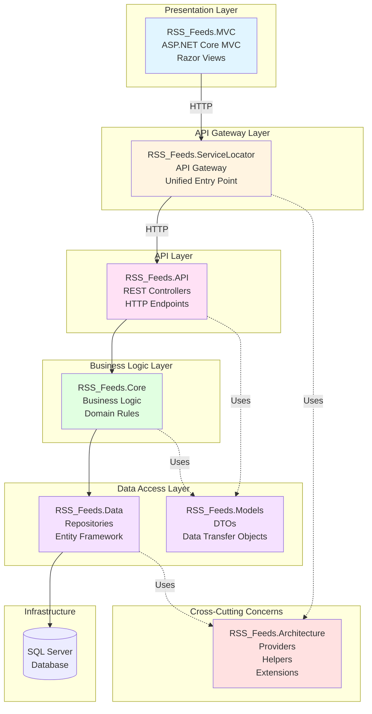
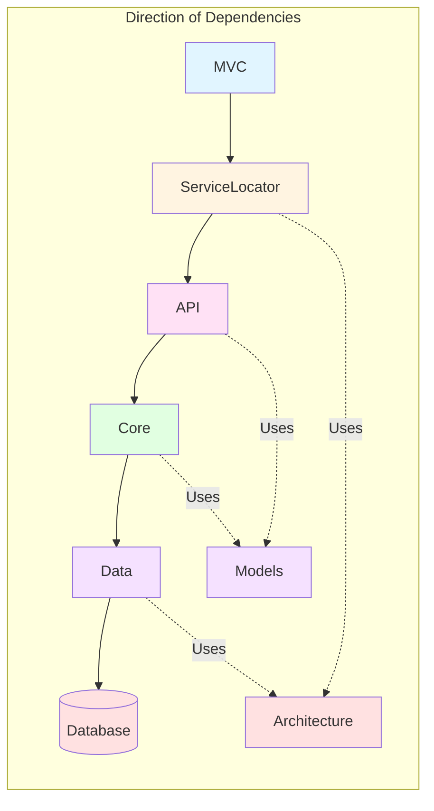
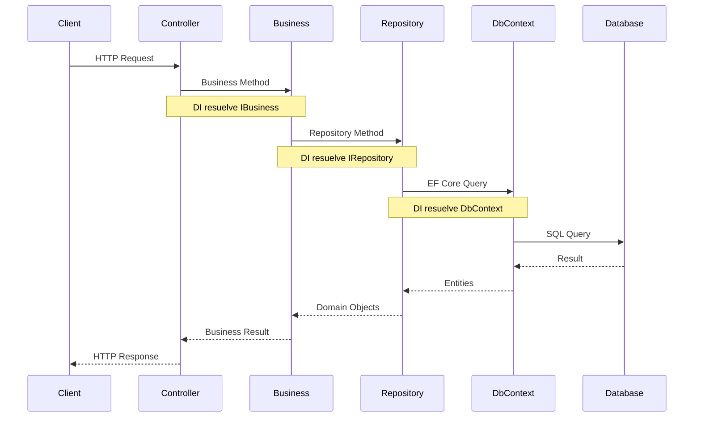

# Documentación del Proyecto RSS Feeds

## 📋 Índice

1. [Visión General](#visión-general)
2. [Stack Tecnológico y Versiones](#stack-tecnológico-y-versiones)
3. [Arquitectura del Proyecto](#arquitectura-del-proyecto)
4. [Patrones de Diseño](#patrones-de-diseño)
5. [Estructura de Carpetas](#estructura-de-carpetas)
6. [Dependency Injection y Configuración de Servicios](#dependency-injection-y-configuración-de-servicios)
7. [APIs Disponibles](#apis-disponibles)
8. [Interfaz Gráfica (MVC)](#interfaz-gráfica-mvc)
9. [Modelos de Datos](#modelos-de-datos)
10. [Flujos de Trabajo](#flujos-de-trabajo)
11. [Configuración y Middleware Pipeline](#configuración-y-middleware-pipeline)
12. [Base de Datos](#base-de-datos)
13. [Servicios y Componentes](#servicios-y-componentes)
14. [Mejores Prácticas Aplicadas](#mejores-prácticas-aplicadas)
15. [Manejo de Errores y Excepciones](#manejo-de-errores-y-excepciones)

---

## 🎯 Visión General

**RSS Feeds** es una aplicación agregadora de feeds RSS que permite a los usuarios:

- **Seguir/Dejar de seguir** feeds RSS personalizados
- **Visualizar un timeline personalizado** con artículos de los feeds seguidos
- **Guardar artículos** (sistema de "likes") para lectura posterior
- **Descubrir nuevos feeds** RSS para seguir
- **Gestionar sus artículos guardados**

La aplicación está construida con **ASP.NET Core 8.0** siguiendo una arquitectura en capas con separación de responsabilidades y principios SOLID.

---

## 🛠️ Stack Tecnológico y Versiones

### Tecnologías Principales

- **.NET 8.0** - Framework principal
- **ASP.NET Core 8.0** - Framework web
- **Entity Framework Core 8.0** - ORM para acceso a datos
- **SQL Server** - Base de datos relacional
- **C# 12** - Lenguaje de programación

### Características de .NET 8.0 Utilizadas

#### Primary Constructors (C# 12)
Se utilizan constructores primarios para simplificar la inyección de dependencias:

```csharp
public class FeedBusiness(IRepositoryFeed repo) : IFeedBusiness
{
    private readonly IRepositoryFeed _repo = repo;
    // ...
}
```

#### Nullable Reference Types
Todo el proyecto tiene habilitado `Nullable` en los archivos `.csproj`:
```xml
<Nullable>enable</Nullable>
```

#### Minimal API Configuration
Configuración simplificada en `Program.cs` sin `Startup.cs`:
```csharp
var builder = WebApplication.CreateBuilder(args);
// Configuración de servicios
var app = builder.Build();
// Pipeline de middleware
```

#### Async/Await Pattern
Todas las operaciones de I/O son asíncronas:
```csharp
public async Task<IEnumerable<Feed>> GetAsync()
    => await _repo.ReadAsync();
```

### NuGet Packages Principales

- **Microsoft.EntityFrameworkCore.SqlServer** - Proveedor SQL Server para EF Core
- **Microsoft.EntityFrameworkCore.Tools** - Herramientas para migraciones
- **Swashbuckle.AspNetCore** - Swagger/OpenAPI
- **BCrypt.Net-Next** - Hashing de contraseñas

---

## 🏗️ Arquitectura del Proyecto

El proyecto utiliza una **arquitectura en capas (Layered Architecture)** con separación clara de responsabilidades, siguiendo los principios de Clean Architecture.

### Diagrama de Arquitectura General



### Flujo de Dependencias



### Responsabilidades por Capa

| Capa | Responsabilidad | Principios Aplicados |
|------|----------------|---------------------|
| **MVC** | Presentación, UI, Sesiones | Separación de Concerns |
| **ServiceLocator** | Gateway, Enrutamiento, Agregación | API Gateway Pattern |
| **API** | Controllers REST, Validación de entrada | Single Responsibility |
| **Core** | Lógica de negocio, Reglas de dominio | Business Logic Isolation |
| **Data** | Acceso a datos, Repositorios, EF Core | Repository Pattern |
| **Models** | DTOs, Contratos de datos | Data Transfer Object |
| **Architecture** | Utilidades compartidas, Helpers | DRY, Reusabilidad |

### Capas del Proyecto

1. **RSS_Feeds.MVC**: Frontend web con Razor Pages
2. **RSS_Feeds.ServiceLocator**: API Gateway que centraliza las llamadas
3. **RSS_Feeds.API**: Web API con controladores REST
4. **RSS_Feeds.Core**: Lógica de negocio (Business Logic)
5. **RSS_Feeds.Data**: Acceso a datos (Repositorios y Entity Framework)
6. **RSS_Feeds.Models**: DTOs (Data Transfer Objects)
7. **RSS_Feeds.Architecture**: Utilidades y helpers compartidos (Cross-cutting Concerns)

---

## 🎨 Patrones de Diseño

El proyecto implementa varios patrones de diseño arquitectónicos y creacionales que garantizan la mantenibilidad, escalabilidad y testabilidad del código.

### 1. Repository Pattern

**Propósito**: Abstraer la lógica de acceso a datos y proporcionar una interfaz más orientada a objetos.

**Implementación**:

Se implementa una clase base genérica `RepositoryBase<T>` que proporciona operaciones CRUD comunes:

```csharp
public abstract class RepositoryBase<T> : IRepositoryBase<T> where T : class
{
    private readonly RssDbContext _context;
    protected RssDbContext DbContext => _context;
    protected DbSet<T> DbSet;

    protected RepositoryBase(RssDbContext context)
    {
        _context = context ?? throw new ArgumentNullException(nameof(context));
        DbSet = _context.Set<T>();
    }

    public async Task<bool> CreateAsync(T entity)
    {
        await _context.AddAsync(entity);
        return await SaveAsync();
    }

    public async Task<IEnumerable<T>> ReadAsync()
    {
        return await _context.Set<T>().ToListAsync();
    }
    // ... otros métodos CRUD
}
```

**Repositorios Específicos**:

Cada entidad tiene su repositorio que extiende `RepositoryBase` y agrega métodos específicos:

```csharp
public class RepositoryFeed : RepositoryBase<Feed>, IRepositoryFeed
{
    public RepositoryFeed(RssDbContext ctx) : base(ctx) { }

    public async Task<bool> CheckBeforeSavingAsync(Feed entity)
    {
        if (string.IsNullOrWhiteSpace(entity.Url))
            return false;

        var exists = await ExistsAsync(entity);
        return await UpsertAsync(entity, exists);
    }
}
```

**Beneficios**:
- Desacopla la lógica de negocio del acceso a datos
- Facilita el testing mediante mocks
- Centraliza la lógica de acceso a datos
- Permite cambiar la implementación de persistencia sin afectar otras capas

---

### 2. API Gateway Pattern

**Propósito**: Proporcionar un punto de entrada único para todas las llamadas a APIs, simplificando el cliente y agregando funcionalidades transversales.

**Implementación**:

El `ServiceLocator` actúa como API Gateway, centralizando todas las llamadas:

```csharp
[Route("api/[controller]")]
public class ServiceLocatorController : ControllerBase
{
    private readonly IFeedService _feedService;
    private readonly IUsuarioService _usuarioService;
    // ... otros servicios

    [HttpGet("feeds")]
    public Task<IEnumerable<FeedDTO>> GetFeeds()
        => _feedService.GetDataAsync();
}
```

**Beneficios**:
- Cliente único simplificado (MVC solo conoce ServiceLocator)
- Facilita agregación de respuestas de múltiples servicios
- Permite agregar cross-cutting concerns (logging, autenticación, rate limiting)
- Encapsula la complejidad de múltiples APIs internas

---

### 3. Dependency Injection Pattern

**Propósito**: Inversión de control para desacoplar componentes y facilitar el testing.

**Configuración en API Layer**:

```csharp
// RSS_Feeds.API/Program.cs
builder.Services.AddDbContext<RssDbContext>(opt =>
    opt.UseSqlServer(builder.Configuration.GetConnectionString("DefaultConnection")));

builder.Services.AddScoped<IRepositoryUsuario, RepositoryUsuario>();
builder.Services.AddScoped<IUsuarioBusiness, UsuarioBusiness>();
```

**Configuración en ServiceLocator**:

```csharp
// RSS_Feeds.ServiceLocator/Program.cs
builder.Services.AddHttpClient();
builder.Services.AddScoped<IRestProvider, RestProvider>();
builder.Services.AddScoped<IFeedService, FeedService>();
```

**Uso mediante Primary Constructors (C# 12)**:

```csharp
public class FeedBusiness(IRepositoryFeed repo) : IFeedBusiness
{
    private readonly IRepositoryFeed _repo = repo;
    // ...
}
```

**Ciclo de Vida de Servicios**:
- **Scoped**: Repositorios y Business Logic (por request HTTP)
- **Singleton**: Configuración compartida
- **Transient**: Servicios sin estado compartido

---

### 4. DTO Pattern (Data Transfer Object)

**Propósito**: Transferir datos entre capas sin exponer las entidades de dominio directamente.

**Ejemplo de DTO**:

```csharp
public class FeedDTO
{
    public int Id { get; set; }
    public string Url { get; set; }
    public string? Titulo { get; set; }
    public string? Descripcion { get; set; }
    // ... sin propiedades de navegación de EF
}
```

**Conversión Entity → DTO**:

Se realiza en la capa de API o mediante mapeo manual para evitar exposición de información sensible o propiedades de navegación de Entity Framework.

**Beneficios**:
- Control de qué datos se exponen
- Evita problemas de serialización cíclica
- Permite versionado de APIs
- Separación entre modelo de dominio y modelo de transferencia

---

### 5. Service Layer Pattern

**Propósito**: Encapsular la lógica de aplicación y orquestar llamadas a repositorios y lógica de negocio.

**Implementación en Business Layer**:

```csharp
public interface IFeedBusiness
{
    Task<IEnumerable<Feed>> GetAsync();
    Task<IEnumerable<Feed>> GetByIdAsync(int id);
    Task<bool> SaveAsync(Feed entity);
}

public class FeedBusiness(IRepositoryFeed repo) : IFeedBusiness
{
    private readonly IRepositoryFeed _repo = repo;

    public Task<IEnumerable<Feed>> GetAsync()
        => _repo.ReadAsync();

    public Task<bool> SaveAsync(Feed entity)
        => _repo.CheckBeforeSavingAsync(entity);
}
```

**Service Layer en ServiceLocator**:

Los servicios en ServiceLocator actúan como clientes HTTP para las APIs internas:

```csharp
public class FeedService(IRestProvider restProvider, IConfiguration configuration)
    : IFeedService
{
    public async Task<IEnumerable<FeedDTO>> GetDataAsync()
    {
        var url = configuration.GetStringFromAppSettings("APIS", "Feed");
        var response = await restProvider.GetAsync(url, null);
        return await JsonProvider.DeserializeAsync<IEnumerable<FeedDTO>>(response);
    }
}
```

**Beneficios**:
- Encapsula lógica de aplicación compleja
- Facilita reutilización entre diferentes controladores
- Permite agregar lógica de negocio sin afectar controladores

---

### 6. Provider Pattern

**Propósito**: Abstraer operaciones específicas (HTTP, JSON) en interfaces intercambiables.

**RestProvider**:

```csharp
public interface IRestProvider
{
    Task<string> GetAsync(string endpoint, string? id);
    Task<string> PostAsync(string endpoint, string content);
    Task<string> PutAsync(string endpoint, string id, string content);
    Task<string> DeleteAsync(string endpoint, string id);
}

public class RestProvider : IRestProvider
{
    public async Task<string> GetAsync(string endpoint, string? id)
    {
        var response = await RestProviderHelpers.CreateHttpClient(endpoint)
            .GetAsync(id);
        return await RestProviderHelpers.GetResponse(response);
    }
}
```

**JsonProvider**:

```csharp
// Serialización/deserialización JSON centralizada
```

**Beneficios**:
- Abstracción de implementaciones específicas
- Facilita testing (mock de providers)
- Permite cambiar implementación sin afectar consumidores

---

### 7. Unit of Work Pattern (Implícito)

**Propósito**: Mantener consistencia de transacciones en operaciones que involucran múltiples repositorios.

**Implementación**:

Entity Framework `DbContext` actúa como Unit of Work implícito:

```csharp
public class RssDbContext : DbContext
{
    public DbSet<Usuario> Usuarios { get; set; }
    public DbSet<Feed> Feeds { get; set; }
    // ...

    protected async Task<bool> SaveAsync()
    {
        var result = await _context.SaveChangesAsync();
        return result > 0;
    }
}
```

Todos los cambios en un mismo `DbContext` se guardan atomáticamente con `SaveChangesAsync()`.

---

### 8. Template Method Pattern

**Propósito**: Definir el esqueleto de un algoritmo en una clase base, delegando pasos específicos a subclases.

**Ejemplo en RepositoryBase**:

```csharp
public async Task<bool> UpsertAsync(T entity, bool isUpdating)
{
    return isUpdating
        ? await UpdateAsync(entity)  // Método template
        : await CreateAsync(entity);  // Método template
}
```

---

## 💉 Dependency Injection y Configuración de Servicios

### Configuración por Capa

#### 1. API Layer (`RSS_Feeds.API/Program.cs`)

```csharp
var builder = WebApplication.CreateBuilder(args);

// Controllers y Swagger
builder.Services.AddControllers();
builder.Services.AddEndpointsApiExplorer();
builder.Services.AddSwaggerGen();

// DbContext (Scoped - una instancia por request)
builder.Services.AddDbContext<RssDbContext>(opt =>
    opt.UseSqlServer(builder.Configuration.GetConnectionString("DefaultConnection")));

// Repositorios (Scoped)
builder.Services.AddScoped<IRepositoryUsuario, RepositoryUsuario>();
builder.Services.AddScoped<IRepositoryFeed, RepositoryFeed>();
// ... otros repositorios

// Business Logic (Scoped)
builder.Services.AddScoped<IUsuarioBusiness, UsuarioBusiness>();
builder.Services.AddScoped<IFeedBusiness, FeedBusiness>();
// ... otras clases de negocio
```

**Características**:
- Todos los servicios están registrados como **Scoped** (una instancia por request HTTP)
- El `DbContext` se inyecta automáticamente en los repositorios
- Primary Constructors simplifican la inyección

#### 2. ServiceLocator Layer (`RSS_Feeds.ServiceLocator/Program.cs`)

```csharp
var builder = WebApplication.CreateBuilder(args);

// Controllers y Swagger
builder.Services.AddControllers();
builder.Services.AddEndpointsApiExplorer();
builder.Services.AddSwaggerGen();

// HttpClient Factory Pattern
builder.Services.AddHttpClient();

// Providers (Scoped)
builder.Services.AddScoped<IRestProvider, RestProvider>();

// Services (Scoped)
builder.Services.AddScoped<IFeedService, FeedService>();
builder.Services.AddScoped<IUsuarioService, UsuarioService>();
// ... otros servicios

// JSON Options (para evitar referencias circulares)
builder.Services.AddControllers()
    .AddJsonOptions(opt =>
    {
        opt.JsonSerializerOptions.ReferenceHandler = 
            System.Text.Json.Serialization.ReferenceHandler.IgnoreCycles;
    });
```

**Características**:
- `HttpClient` configurado mediante Factory Pattern para mejor manejo de conexiones
- `IConfiguration` inyectado directamente para acceder a `appsettings.json`
- Configuración de JSON para evitar problemas de serialización cíclica

#### 3. MVC Layer (`RSS_Feeds.MVC/Program.cs`)

```csharp
var builder = WebApplication.CreateBuilder(args);

// MVC
builder.Services.AddControllersWithViews();

// Servicios del frontend
builder.Services.AddScoped<IRssReaderService, RssReaderService>();

// Session (para autenticación)
builder.Services.AddSession(options =>
{
    options.IdleTimeout = TimeSpan.FromMinutes(30);
    options.Cookie.HttpOnly = true;
    options.Cookie.IsEssential = true;
});

// HttpClient para consumir ServiceLocator
builder.Services.AddHttpClient("ApiClient", client =>
{
    client.BaseAddress = new Uri("https://localhost:7094/");
});
```

**Características**:
- Session configurada con timeout de 30 minutos
- HttpClient nombrado para consumir el ServiceLocator
- Scoped services para servicios que dependen del contexto HTTP

### Resolución de Dependencias

El contenedor de DI de .NET Core resuelve automáticamente las dependencias mediante:

1. **Constructor Injection**: Dependencias inyectadas vía constructores
2. **Primary Constructors**: Simplifica la sintaxis (C# 12)
3. **Lifetime Management**: 
   - **Scoped**: Una instancia por request HTTP (repositorios, business logic)
   - **Singleton**: Una instancia para toda la aplicación (configuración)
   - **Transient**: Nueva instancia cada vez (servicios stateless)

### Ejemplo de Cadena de Dependencias



---

## 📁 Estructura de Carpetas

```
RSS_Feeds/
│
├── RSS_Feeds.MVC/                    # Frontend Web (ASP.NET MVC)
│   ├── Controllers/                  # Controladores MVC
│   │   ├── AccountController.cs      # Autenticación (Login/Register/Logout)
│   │   ├── HomeController.cs         # Página principal (Timeline)
│   │   ├── FeedsController.cs        # Gestión de feeds (Discover/Saved)
│   │   └── ArticlesController.cs     # Gestión de artículos
│   ├── Views/                        # Vistas Razor
│   │   ├── Account/                  # Login.cshtml, Register.cshtml
│   │   ├── Home/                     # Index.cshtml (Timeline)
│   │   ├── Feeds/                    # Discover.cshtml, Saved.cshtml
│   │   └── Shared/                   # _Layout.cshtml, _AuthLayout.cshtml
│   ├── Models/                       # ViewModels para las vistas
│   ├── Services/                     # Servicios del frontend
│   │   ├── IRssReaderService.cs      # Interface para lectura RSS
│   │   └── RssReaderService.cs       # Implementación lector RSS
│   └── wwwroot/                      # Archivos estáticos (CSS, JS)
│
├── RSS_Feeds.ServiceLocator/         # API Gateway
│   ├── Controllers/
│   │   └── ServiceLocatorController.cs  # Controlador único que expone todas las APIs
│   ├── Services/                     # Servicios que consumen RSS_Feeds.API
│   │   ├── IFeedService.cs
│   │   ├── IUsuarioService.cs
│   │   ├── IArticuloService.cs
│   │   ├── IUsuarioFeedService.cs
│   │   ├── IUsuarioArticulosGuardadoService.cs
│   │   └── IAuthService.cs
│   └── appsettings.json              # URLs de las APIs internas
│
├── RSS_Feeds.API/                    # Web API
│   ├── Controllers/                  # Controladores REST
│   │   ├── FeedApiController.cs
│   │   ├── UsuarioApiController.cs
│   │   ├── ArticuloApiController.cs
│   │   ├── UsuarioFeedApiController.cs
│   │   ├── UsuarioArticulosGuardadoApiController.cs
│   │   └── AuthController.cs
│   └── Program.cs                    # Configuración y DI
│
├── RSS_Feeds.Core/                   # Lógica de Negocio
│   ├── BusinessLogic/
│   │   ├── FeedBusiness.cs
│   │   ├── UsuarioBusiness.cs
│   │   ├── ArticuloBusiness.cs
│   │   ├── UsuarioFeedBusiness.cs
│   │   └── UsuarioArticulosGuardadoBusiness.cs
│
├── RSS_Feeds.Data/                   # Acceso a Datos
│   ├── Models/                       # Entidades de Entity Framework
│   │   ├── Usuario.cs
│   │   ├── Feed.cs
│   │   ├── Articulo.cs
│   │   ├── UsuarioFeed.cs
│   │   ├── UsuarioArticulosGuardado.cs
│   │   └── RssDbContext.cs           # Contexto de Entity Framework
│   └── Repositories/                 # Repositorios (patrón Repository)
│       ├── RepositoryBase.cs
│       ├── RepositoryUsuario.cs
│       ├── RepositoryFeed.cs
│       ├── RepositoryArticulo.cs
│       ├── RepositoryUsuarioFeed.cs
│       └── RepositoryUsuarioArticulosGuardado.cs
│
├── RSS_Feeds.Models/                 # DTOs (Data Transfer Objects)
│   └── DTOs/
│       ├── FeedDTO.cs
│       ├── UsuarioDTO.cs
│       ├── ArticuloDTO.cs
│       ├── UsuarioFeedDTO.cs
│       ├── UsuarioArticulosGuardadoDTO.cs
│       ├── LoginRequestDTO.cs
│       ├── LoginResponseDTO.cs
│       ├── RegisterRequestDTO.cs
│       ├── FollowFeedRequestDTO.cs
│       └── LikeArticleRequestDTO.cs
│
└── RSS_Feeds.Architecture/           # Utilidades Compartidas
    ├── Extensions/
    ├── Helpers/
    └── Providers/
        ├── RestProvider.cs           # Cliente HTTP para APIs
        └── JsonProvider.cs           # Serialización JSON
```

---

## 🔌 APIs Disponibles

El proyecto expone todas las APIs a través del **ServiceLocator** (API Gateway), que actúa como punto de entrada unificado. La base URL es:

**Base URL**: `https://localhost:7094/api/ServiceLocator`

### 🔐 Autenticación

#### POST `/api/ServiceLocator/auth/login`

Inicia sesión de un usuario.

**Request Body:**
```json
{
  "email": "usuario@example.com",
  "password": "password123"
}
```

**Response (200 OK):**
```json
{
  "id": 1,
  "email": "usuario@example.com",
  "nombre": "Nombre Usuario"
}
```

**Errores:**
- `401 Unauthorized`: Credenciales inválidas

---

#### POST `/api/ServiceLocator/auth/register`

Registra un nuevo usuario.

**Request Body:**
```json
{
  "email": "nuevo@example.com",
  "password": "password123",
  "nombre": "Nombre Usuario",
  "confirmPassword": "password123"
}
```

**Response (200 OK):**
```json
true
```

**Errores:**
- `400 Bad Request`: Email ya existe o datos inválidos

---

### 📰 Feeds

#### GET `/api/ServiceLocator/feeds`

Obtiene todos los feeds disponibles.

**Response:**
```json
[
  {
    "id": 1,
    "url": "https://example.com/feed.xml",
    "titulo": "Título del Feed",
    "descripcion": "Descripción del feed",
    "idioma": "es",
    "categoria": "Tecnología",
    "ultimaLectura": "2024-01-01T00:00:00Z"
  }
]
```

---

#### GET `/api/ServiceLocator/feeds/{id}`

Obtiene un feed específico por ID.

**Parámetros:**
- `id` (int): ID del feed

**Response:**
```json
[
  {
    "id": 1,
    "url": "https://example.com/feed.xml",
    ...
  }
]
```

---

#### POST `/api/ServiceLocator/feeds`

Crea un nuevo feed.

**Request Body:**
```json
{
  "url": "https://example.com/feed.xml",
  "titulo": "Nuevo Feed",
  "descripcion": "Descripción",
  "idioma": "es",
  "categoria": "Tecnología"
}
```

**Response:** `true` (boolean)

---

#### PUT `/api/ServiceLocator/feeds/{id}`

Actualiza un feed existente.

**Parámetros:**
- `id` (int): ID del feed

**Request Body:** Igual que POST

**Response:** `true` (boolean)

---

#### DELETE `/api/ServiceLocator/feeds/{id}`

Elimina un feed.

**Parámetros:**
- `id` (int): ID del feed

**Response:** `true` (boolean)

---

### 👤 Usuarios

#### GET `/api/ServiceLocator/usuarios`

Obtiene todos los usuarios.

**Response:**
```json
[
  {
    "id": 1,
    "email": "usuario@example.com",
    "nombre": "Nombre Usuario",
    "creadoEn": "2024-01-01T00:00:00Z"
  }
]
```

---

#### GET `/api/ServiceLocator/usuarios/{id}`

Obtiene un usuario específico por ID.

---

#### POST `/api/ServiceLocator/usuarios`

Crea un nuevo usuario.

---

#### PUT `/api/ServiceLocator/usuarios/{id}`

Actualiza un usuario.

---

#### DELETE `/api/ServiceLocator/usuarios/{id}`

Elimina un usuario.

---

### 📄 Artículos

#### GET `/api/ServiceLocator/articulos`

Obtiene todos los artículos guardados en la base de datos.

**Response:**
```json
[
  {
    "id": 1,
    "feedId": 5,
    "titulo": "Título del Artículo",
    "link": "https://example.com/article",
    "descripcion": "Descripción del artículo",
    "contenido": "Contenido completo",
    "autor": "Autor del artículo",
    "imagen": "https://example.com/image.jpg",
    "fechaPublicacion": "2024-01-01T00:00:00Z",
    "creadoEn": "2024-01-01T00:00:00Z"
  }
]
```

---

#### GET `/api/ServiceLocator/articulos/{id}`

Obtiene un artículo específico por ID.

---

#### POST `/api/ServiceLocator/articulos`

Crea un nuevo artículo.

**Request Body:**
```json
{
  "feedId": 5,
  "titulo": "Título del Artículo",
  "link": "https://example.com/article",
  "descripcion": "Descripción",
  "contenido": "Contenido completo",
  "autor": "Autor",
  "imagen": "https://example.com/image.jpg",
  "fechaPublicacion": "2024-01-01T00:00:00Z"
}
```

**Response:** ID del artículo creado (int)

---

#### PUT `/api/ServiceLocator/articulos/{id}`

Actualiza un artículo.

---

#### DELETE `/api/ServiceLocator/articulos/{id}`

Elimina un artículo.

---

### 🔗 Usuario-Feed (Suscripciones)

#### GET `/api/ServiceLocator/usuario-feed`

Obtiene todas las suscripciones de usuarios a feeds.

**Response:**
```json
[
  {
    "id": 1,
    "usuarioId": 1,
    "feedId": 5,
    "alias": "Mi Alias Personalizado",
    "creadoEn": "2024-01-01T00:00:00Z"
  }
]
```

---

#### GET `/api/ServiceLocator/usuario-feed/{id}`

Obtiene una suscripción específica por ID.

---

#### POST `/api/ServiceLocator/usuario-feed`

Crea una nueva suscripción (seguir un feed).

**Request Body:**
```json
{
  "usuarioId": 1,
  "feedId": 5,
  "alias": "Mi Alias Personalizado"
}
```

**Response:** `true` (boolean)

---

#### PUT `/api/ServiceLocator/usuario-feed/{id}`

Actualiza una suscripción.

---

#### DELETE `/api/ServiceLocator/usuario-feed/{id}`

Elimina una suscripción (dejar de seguir un feed).

**Response:** `true` (boolean)

---

### ❤️ Artículos Guardados (Likes)

#### GET `/api/ServiceLocator/usuario-articulos-guardados`

Obtiene todos los artículos guardados por usuarios.

**Response:**
```json
[
  {
    "id": 1,
    "usuarioId": 1,
    "articuloId": 10,
    "fechaGuardado": "2024-01-01T00:00:00Z",
    "notas": "Notas opcionales"
  }
]
```

---

#### GET `/api/ServiceLocator/usuario-articulos-guardados/{id}`

Obtiene un artículo guardado específico por ID.

---

#### POST `/api/ServiceLocator/usuario-articulos-guardados`

Guarda un artículo (like).

**Request Body:**
```json
{
  "usuarioId": 1,
  "articuloId": 10,
  "notas": null
}
```

**Response:** ID del registro creado (int)

---

#### PUT `/api/ServiceLocator/usuario-articulos-guardados/{id}`

Actualiza un artículo guardado.

---

#### DELETE `/api/ServiceLocator/usuario-articulos-guardados/{id}`

Elimina un artículo guardado (unlike).

**Response:** `true` (boolean)

---

## 🖥️ Interfaz Gráfica (MVC)

La aplicación MVC proporciona una interfaz web completa con las siguientes páginas:

### 🎨 Layout Principal

**Archivo:** `Views/Shared/_Layout.cshtml`

- **Sidebar fijo a la izquierda** con:
  - Branding: "RS" + "RSS Feeds - Curated Stream"
  - Navegación:
    - 🏠 Home (Timeline)
    - 🔍 Discover (Descubrir feeds)
    - ❤️ Saved (Artículos guardados)
    - ⎋ Logout
- **Topbar fijo arriba** con:
  - Búsqueda (placeholder: "Buscar feeds, temas o fuentes…")
  - Información del usuario (Nombre y Email)
- **Área de contenido principal** (scrollable)

---

### 📄 Páginas Disponibles

#### 1. Login (`/Account/Login`)

**Controlador:** `AccountController.Login()`

**Vista:** `Views/Account/Login.cshtml`

**Layout:** `_AuthLayout.cshtml` (split-screen)

- **Panel izquierdo (Hero):**
  - Branding
  - Título: "Tu timeline de conocimiento."
  - Subtítulo explicativo
  - Bullets de características
  - Pills: "Privado", "Rápido", "Minimal"

- **Panel derecho (Formulario):**
  - Campo Email (con icono de email)
  - Campo Password (con icono de candado, toggle de visibilidad)
  - Botón "Entrar"
  - Link a registro
  - Mensajes de error si falla

**Funcionalidad:**
- POST a `/api/ServiceLocator/auth/login`
- Almacena `UserId`, `UserEmail`, `UserNombre` en sesión
- Redirige a Home si es exitoso

---

#### 2. Register (`/Account/Register`)

**Controlador:** `AccountController.Register()`

**Vista:** `Views/Account/Register.cshtml`

**Layout:** `_AuthLayout.cshtml`

Similar a Login pero con campos adicionales:
- Email
- Nombre
- Password
- Confirm Password

**Funcionalidad:**
- POST a `/api/ServiceLocator/auth/register`
- Redirige a Login si es exitoso

---

#### 3. Home/Timeline (`/Home/Index`)

**Controlador:** `HomeController.Index()`

**Vista:** `Views/Home/Index.cshtml`

**Funcionalidad:**

1. **Verifica autenticación** (sesión)
2. **Obtiene feeds seguidos** del usuario actual
3. **Lee feeds RSS en tiempo real** usando `RssReaderService`
4. **Combina artículos** de la BD con artículos RSS
5. **Ordena por fecha de publicación** (más recientes primero)
6. **Muestra estado de "like"** para cada artículo

**Estado vacío:**
Si el usuario no sigue ningún feed, muestra:
- Ilustración: 📰
- Título: "Tu feed está vacío"
- Mensaje explicativo
- Botones: "Buscar feeds" y "Explorar populares"

**Tarjetas de artículos:**
Cada artículo muestra:
- Imagen del artículo (si está disponible)
- Nombre del feed fuente
- Fecha de publicación (formato: "dd MMM yyyy")
- Título del artículo
- Descripción (truncada si es larga)
- Botón Like (🤍 no likeado, ❤️ likeado)
- Botón "Leer" (abre link en nueva pestaña)

---

#### 4. Discover (`/Feeds/Discover`)

**Controlador:** `FeedsController.Discover()`

**Vista:** `Views/Feeds/Discover.cshtml`

**Funcionalidad:**

1. **Obtiene todos los feeds disponibles**
2. **Obtiene suscripciones del usuario**
3. **Marca qué feeds ya están seguidos**
4. **Muestra grid de tarjetas de feeds**

**Tarjetas de feeds:**
- Avatar (primeras 2 letras del título, mayúsculas)
- Título del feed
- URL del feed
- Descripción
- Botón:
  - "Seguir" si no está seguido
  - "Siguiendo" si ya está seguido

**Modal al seguir:**
Al hacer clic en "Seguir":
- Título: "Seguir feed"
- Muestra nombre del feed
- Campo opcional de alias
- Botones: "Seguir" y "Cancelar"

**Acciones:**
- **Seguir:** POST a `/api/ServiceLocator/usuario-feed`
- **Dejar de seguir:** POST a `/Feeds/Unfollow?usuarioFeedId={id}`

---

#### 5. Saved (`/Feeds/Saved`)

**Controlador:** `FeedsController.Saved()`

**Vista:** `Views/Feeds/Saved.cshtml`

**Funcionalidad:**

1. **Obtiene artículos guardados** del usuario actual
2. **Obtiene información de artículos** y feeds relacionados
3. **Ordena por fecha de guardado** (más recientes primero)
4. **Muestra tarjetas de artículos** similares al timeline

**Estado vacío:**
Si no hay artículos guardados:
- Ilustración: ❤️
- Título: "No tienes artículos guardados"
- Mensaje explicativo
- Botón: "Ir al feed"

---

#### 6. Articles Controller (API Endpoints)

**Controlador:** `ArticlesController`

**No tiene vistas** - Solo expone endpoints para acciones AJAX.

**Endpoints:**

##### POST `/Articles/Like`

Guarda un artículo (like).

**Request Body:**
```json
{
  "feedId": 5,
  "titulo": "Título del Artículo",
  "link": "https://example.com/article",
  "descripcion": "Descripción",
  "autor": "Autor",
  "imagen": "https://example.com/image.jpg",
  "fechaPublicacion": "2024-01-01T00:00:00Z"
}
```

**Funcionalidad:**
1. Verifica autenticación (sesión)
2. Crea artículo en BD (POST `/api/ServiceLocator/articulos`)
3. Si el artículo ya existe (mismo Link), no crea duplicado
4. Obtiene el ID del artículo (buscando por Link)
5. Crea relación usuario-artículo (POST `/api/ServiceLocator/usuario-articulos-guardados`)
6. Retorna 200 OK

**Response:** `200 OK` o `500 Internal Server Error`

---

##### DELETE `/Articles/Unlike?id={id}`

Elimina un like (unlike).

**Parámetros:**
- `id` (int): ID del registro `UsuarioArticulosGuardado`

**Funcionalidad:**
1. Verifica autenticación
2. DELETE `/api/ServiceLocator/usuario-articulos-guardados/{id}`
3. Retorna 200 OK

**Response:** `200 OK` o `400 Bad Request`

---

### 🔧 Servicios del Frontend

#### RssReaderService

**Interface:** `IRssReaderService`
**Implementación:** `RssReaderService`

**Método principal:**
```csharp
Task<List<RssItem>> ReadAsync(string feedUrl, string feedTitle)
```

**Funcionalidad:**
- Lee un feed RSS desde una URL
- Parsea XML del feed
- Extrae imágenes de múltiples fuentes:
  1. Enclosure con tipo "image"
  2. Media:content (Yahoo Media RSS)
  3. Media:thumbnail (BBC, CNN, etc.)
  4. Etiquetas `` en HTML de descripción/contenido
- Retorna lista de `RssItem` con:
  - Title
  - Link
  - Description
  - Author
  - PublishedAt
  - FeedTitle
  - FeedUrl
  - ImageUrl

---

## 📊 Modelos de Datos

### Entidades (Base de Datos)

#### Usuario

```csharp
public class Usuario
{
    public int Id { get; set; }
    public string? Nombre { get; set; }
    public string Email { get; set; }
    public string PasswordHash { get; set; }
    public DateTime? CreadoEn { get; set; }
    
    // Navegación
    public ICollection<UsuarioFeed> UsuarioFeeds { get; set; }
    public ICollection<UsuarioArticulosGuardado> UsuarioArticulosGuardados { get; set; }
}
```

**Tabla:** `usuarios`
**Índices únicos:** Email

---

#### Feed

```csharp
public class Feed
{
    public int Id { get; set; }
    public string Url { get; set; }
    public string? Titulo { get; set; }
    public string? Descripcion { get; set; }
    public string? Idioma { get; set; }
    public string? Categoria { get; set; }
    public DateTime? UltimaLectura { get; set; }
    
    // Navegación
    public ICollection<Articulo> Articulos { get; set; }
    public ICollection<UsuarioFeed> UsuarioFeeds { get; set; }
}
```

**Tabla:** `feeds`
**Índices únicos:** Url

---

#### Articulo

```csharp
public class Articulo
{
    public int Id { get; set; }
    public int FeedId { get; set; }
    public string Titulo { get; set; }
    public string Link { get; set; }
    public string? Descripcion { get; set; }
    public string? Contenido { get; set; }
    public string? Autor { get; set; }
    public string? Imagen { get; set; }
    public DateTime? FechaPublicacion { get; set; }
    public DateTime? CreadoEn { get; set; }
    
    // Navegación
    public Feed Feed { get; set; }
    public ICollection<UsuarioArticulosGuardado> UsuarioArticulosGuardados { get; set; }
}
```

**Tabla:** `articulos`
**Índices únicos:** Link
**Foreign Key:** FeedId → Feeds.Id

---

#### UsuarioFeed

```csharp
public class UsuarioFeed
{
    public int Id { get; set; }
    public int UsuarioId { get; set; }
    public int FeedId { get; set; }
    public string? Alias { get; set; }
    public DateTime? CreadoEn { get; set; }
    
    // Navegación
    public Usuario Usuario { get; set; }
    public Feed Feed { get; set; }
}
```

**Tabla:** `usuario_feeds`
**Índices únicos compuestos:** (UsuarioId, FeedId) - Un usuario no puede seguir el mismo feed dos veces
**Foreign Keys:** UsuarioId → Usuarios.Id, FeedId → Feeds.Id

---

#### UsuarioArticulosGuardado

```csharp
public class UsuarioArticulosGuardado
{
    public int Id { get; set; }
    public int UsuarioId { get; set; }
    public int ArticuloId { get; set; }
    public DateTime? FechaGuardado { get; set; }
    public string? Notas { get; set; }
    
    // Navegación
    public Usuario Usuario { get; set; }
    public Articulo Articulo { get; set; }
}
```

**Tabla:** `usuario_articulos_guardados`
**Índices únicos compuestos:** (UsuarioId, ArticuloId) - Un usuario no puede guardar el mismo artículo dos veces
**Foreign Keys:** UsuarioId → Usuarios.Id, ArticuloId → Articulos.Id

---

### DTOs (Data Transfer Objects)

#### FeedDTO

```csharp
public class FeedDTO
{
    public int Id { get; set; }
    public string Url { get; set; }
    public string? Titulo { get; set; }
    public string? Descripcion { get; set; }
    public string? Idioma { get; set; }
    public string? Categoria { get; set; }
    public DateTime? UltimaLectura { get; set; }
}
```

---

#### ArticuloDTO

```csharp
public class ArticuloDTO
{
    public int Id { get; set; }
    public int FeedId { get; set; }
    public string Titulo { get; set; }
    public string Link { get; set; }
    public string? Descripcion { get; set; }
    public string? Contenido { get; set; }
    public string? Autor { get; set; }
    public string? Imagen { get; set; }
    public DateTime? FechaPublicacion { get; set; }
    public DateTime? CreadoEn { get; set; }
}
```

---

#### UsuarioFeedDTO

```csharp
public class UsuarioFeedDTO
{
    public int Id { get; set; }
    public int UsuarioId { get; set; }
    public int FeedId { get; set; }
    public string? Alias { get; set; }
    public DateTime? CreadoEn { get; set; }
}
```

---

#### UsuarioArticulosGuardadoDTO

```csharp
public class UsuarioArticulosGuardadoDTO
{
    public int Id { get; set; }
    public int UsuarioId { get; set; }
    public int ArticuloId { get; set; }
    public DateTime? FechaGuardado { get; set; }
    public string? Notas { get; set; }
}
```

---

#### LoginRequestDTO

```csharp
public class LoginRequestDTO
{
    public string Email { get; set; }
    public string Password { get; set; }
}
```

---

#### LoginResponseDTO

```csharp
public class LoginResponseDTO
{
    public int Id { get; set; }
    public string? Email { get; set; }
    public string? Nombre { get; set; }
}
```

---

#### RegisterRequestDTO

```csharp
public class RegisterRequestDTO
{
    public string Email { get; set; }
    public string Password { get; set; }
    public string Nombre { get; set; }
    public string? ConfirmPassword { get; set; }
}
```

---

## 🔄 Flujos de Trabajo

### 1. Flujo de Autenticación

```
Usuario → Login Page
    ↓
Ingresa Email y Password
    ↓
POST /api/ServiceLocator/auth/login
    ↓
ServiceLocator → AuthService
    ↓
AuthService → API /api/auth/login
    ↓
API → UsuarioBusiness → RepositoryUsuario
    ↓
Verifica PasswordHash (BCrypt)
    ↓
Retorna LoginResponseDTO
    ↓
MVC almacena en Sesión:
    - UserId
    - UserEmail
    - UserNombre
    ↓
Redirige a Home/Index
```

---

### 2. Flujo del Timeline

**Diagrama de Secuencia Completo:**

```mermaid
sequenceDiagram
    participant User
    participant MVC as MVC Controller
    participant Session
    participant ServiceLocator
    participant API
    participant Business
    participant Repository
    participant RSSReader as RSS Reader Service
    participant Database
    participant RSSFeed as External RSS Feed

    User->>MVC: GET /Home/Index
    MVC->>Session: Get UserId
    Session-->>MVC: UserId = 1
    
    MVC->>ServiceLocator: GET /usuario-feed (UserId)
    ServiceLocator->>API: GET /UsuarioFeedApi/
    API->>Business: GetUsuarioFeeds(userId)
    Business->>Repository: ReadAsync()
    Repository->>Database: SELECT * FROM usuario_feeds
    Database-->>Repository: UsuarioFeed[]
    Repository-->>Business: UsuarioFeed[]
    Business-->>API: UsuarioFeedDTO[]
    API-->>ServiceLocator: UsuarioFeedDTO[]
    ServiceLocator-->>MVC: UsuarioFeedDTO[]
    
    MVC->>ServiceLocator: GET /feeds
    ServiceLocator->>API: GET /FeedApi/
    API->>Business: GetAsync()
    Business->>Repository: ReadAsync()
    Repository->>Database: SELECT * FROM feeds
    Database-->>Repository: Feed[]
    Repository-->>Business: Feed[]
    Business-->>API: FeedDTO[]
    API-->>ServiceLocator: FeedDTO[]
    ServiceLocator-->>MVC: FeedDTO[]
    
    loop Para cada Feed seguido
        MVC->>RSSReader: ReadAsync(feedUrl, feedTitle)
        RSSReader->>RSSFeed: HTTP GET feedUrl
        RSSFeed-->>RSSReader: XML Response
        RSSReader->>RSSReader: Parse XML
        RSSReader-->>MVC: List&lt;RssItem&gt;
    end
    
    MVC->>ServiceLocator: GET /articulos
    ServiceLocator->>API: GET /ArticuloApi/
    API->>Business: GetAsync()
    Business->>Repository: ReadAsync()
    Repository->>Database: SELECT * FROM articulos
    Database-->>Repository: Articulo[]
    Repository-->>Business: Articulo[]
    Business-->>API: ArticuloDTO[]
    API-->>ServiceLocator: ArticuloDTO[]
    ServiceLocator-->>MVC: ArticuloDTO[]
    
    MVC->>ServiceLocator: GET /usuario-articulos-guardados (UserId)
    ServiceLocator->>API: GET /UsuarioArticulosGuardadoApi/
    API->>Business: GetUsuarioArticulosGuardados(userId)
    Business->>Repository: ReadAsync()
    Repository->>Database: SELECT * FROM usuario_articulos_guardados
    Database-->>Repository: UsuarioArticulosGuardado[]
    Repository-->>Business: UsuarioArticulosGuardado[]
    Business-->>API: UsuarioArticulosGuardadoDTO[]
    API-->>ServiceLocator: UsuarioArticulosGuardadoDTO[]
    ServiceLocator-->>MVC: UsuarioArticulosGuardadoDTO[]
    
    MVC->>MVC: Combine RSS Items + DB Articles
    MVC->>MVC: Sort by FechaPublicacion (desc)
    MVC->>MVC: Mark liked articles
    MVC->>User: Render Timeline View
```

```
Usuario → Home/Index
    ↓
HomeController.Index()
    ↓
1. Verifica sesión (UserId)
    ↓
2. GET /api/ServiceLocator/usuario-feed
    → Obtiene feeds seguidos del usuario
    ↓
3. GET /api/ServiceLocator/feeds
    → Obtiene información de los feeds
    ↓
4. GET /api/ServiceLocator/articulos
    → Obtiene artículos guardados en BD
    ↓
5. GET /api/ServiceLocator/usuario-articulos-guardados
    → Obtiene likes del usuario
    ↓
6. Para cada feed seguido:
    → RssReaderService.ReadAsync(feedUrl)
    → Lee RSS en tiempo real
    ↓
7. Combina artículos RSS con artículos de BD
    → Identifica duplicados por Link
    ↓
8. Ordena por FechaPublicacion (descendente)
    ↓
9. Marca qué artículos están "liked"
    ↓
10. Renderiza vista con FeedTimelineItemViewModel
```

**Importante:** Los artículos se leen directamente desde los feeds RSS en cada carga del timeline. Los artículos solo se guardan en BD cuando el usuario hace "like".

---

### 3. Flujo de Seguir un Feed

```
Usuario → Discover Page
    ↓
Ve lista de feeds disponibles
    ↓
Clic en "Seguir"
    ↓
Modal: Opcional alias
    ↓
POST /api/ServiceLocator/usuario-feed
Body: { usuarioId, feedId, alias? }
    ↓
ServiceLocator → UsuarioFeedService
    ↓
UsuarioFeedService → API /api/UsuarioFeedApi/
    ↓
API → UsuarioFeedBusiness → RepositoryUsuarioFeed
    ↓
Valida que no exista (UsuarioId, FeedId) único
    ↓
Crea registro en usuario_feeds
    ↓
Retorna true
    ↓
UI actualiza botón a "Siguiendo"
```

---

### 4. Flujo de Guardar un Artículo (Like)

```
Usuario → Timeline
    ↓
Clic en botón Like (🤍)
    ↓
1. Verifica si artículo existe en BD por Link
    ↓
2. Si NO existe:
    → POST /api/ServiceLocator/articulos
    → Crea artículo en BD
    → Obtiene ID del artículo creado
    ↓
3. POST /api/ServiceLocator/usuario-articulos-guardados
Body: { usuarioId, articuloId, notas? }
    ↓
ServiceLocator → UsuarioArticulosGuardadoService
    ↓
UsuarioArticulosGuardadoService → API
    ↓
API → Business → Repository
    ↓
Valida que no exista (UsuarioId, ArticuloId) único
    ↓
Crea registro en usuario_articulos_guardados
    ↓
Retorna ID
    ↓
UI actualiza botón a ❤️
```

---

### 5. Flujo de Leer Artículos Guardados

```
Usuario → Saved Page
    ↓
FeedsController.Saved()
    ↓
1. Verifica sesión
    ↓
2. GET /api/ServiceLocator/usuario-articulos-guardados
    → Filtra por UsuarioId
    ↓
3. GET /api/ServiceLocator/articulos
    → Obtiene información de artículos
    ↓
4. GET /api/ServiceLocator/feeds
    → Obtiene información de feeds
    ↓
5. Combina datos:
    UsuarioArticulosGuardado + Articulo + Feed
    ↓
6. Ordena por FechaGuardado (descendente)
    ↓
7. Renderiza SavedArticleViewModel
```

---

## ⚙️ Configuración y Middleware Pipeline

### Configuración de Aplicaciones

#### 1. API Application Pipeline

```csharp
var app = builder.Build();

// Development
if (app.Environment.IsDevelopment())
{
    app.UseSwagger();
    app.UseSwaggerUI();
}

// HTTPS Redirection
app.UseHttpsRedirection();

// Authorization
app.UseAuthorization();

// Controllers
app.MapControllers();

app.Run();
```

**Middleware Pipeline**:
1. **HTTPS Redirection**: Redirige HTTP a HTTPS
2. **Authorization**: Middleware de autorización
3. **Routing**: Enrutamiento a controladores
4. **Endpoint Execution**: Ejecución de endpoints

#### 2. ServiceLocator Application Pipeline

Similar a la API pero con configuración específica para API Gateway:

```csharp
var app = builder.Build();

if (app.Environment.IsDevelopment())
{
    app.UseSwagger();
    app.UseSwaggerUI();
}

app.UseHttpsRedirection();
app.UseAuthorization();
app.MapControllers();

app.Run();
```

#### 3. MVC Application Pipeline

```csharp
var app = builder.Build();

// Error Handling
if (!app.Environment.IsDevelopment())
{
    app.UseExceptionHandler("/Home/Error");
    app.UseHsts();
}

// Static Files
app.UseHttpsRedirection();
app.UseStaticFiles();

// Routing
app.UseRouting();

// Session (DEBE ir antes de Authorization)
app.UseSession();

// Authorization
app.UseAuthorization();

// Controller Routing
app.MapControllerRoute(
    name: "default",
    pattern: "{controller=Home}/{action=Index}/{id?}");

app.Run();
```

**Middleware Pipeline MVC**:
1. **Exception Handler**: Manejo de errores en producción
2. **HSTS**: HTTP Strict Transport Security
3. **HTTPS Redirection**: Redirección a HTTPS
4. **Static Files**: Servir archivos estáticos (CSS, JS, imágenes)
5. **Routing**: Determinar el endpoint
6. **Session**: Gestionar sesiones de usuario
7. **Authorization**: Verificar autorización
8. **Endpoint Execution**: Ejecutar acción del controlador

**Importante**: El orden del middleware es crítico. `UseSession()` debe ir después de `UseRouting()` y antes de `UseAuthorization()`.

### Configuración de Archivos

#### appsettings.json

**API (`RSS_Feeds.API/appsettings.json`)**:
```json
{
  "ConnectionStrings": {
    "DefaultConnection": "Server=MORGON\\SQLEXPRESS;Database=rss_app;Trusted_Connection=True;TrustServerCertificate=True;"
  },
  "Logging": {
    "LogLevel": {
      "Default": "Information",
      "Microsoft.AspNetCore": "Warning"
    }
  }
}
```

**ServiceLocator (`RSS_Feeds.ServiceLocator/appsettings.json`)**:
```json
{
  "APIS": [
    {
      "Auth": "https://localhost:7070/api/auth/",
      "Feed": "https://localhost:7070/api/FeedApi/",
      "Usuario": "https://localhost:7070/api/UsuarioApi/",
      "Articulo": "https://localhost:7070/api/ArticuloApi/",
      "UsuarioFeed": "https://localhost:7070/api/UsuarioFeedApi/",
      "UsuarioArticulosGuardado": "https://localhost:7070/api/UsuarioArticulosGuardadoApi/"
    }
  ]
}
```

### Puertos y URLs

| Aplicación | Puerto HTTPS | URL Base |
|-----------|--------------|----------|
| RSS_Feeds.API | 7070 | `https://localhost:7070` |
| RSS_Feeds.ServiceLocator | 7094 | `https://localhost:7094` |
| RSS_Feeds.MVC | Variable | `https://localhost:XXXX` |

---

## ⚙️ Configuración (Legacy - Sección Anterior)

### ServiceLocator (API Gateway)

**Archivo:** `RSS_Feeds.ServiceLocator/appsettings.json`

```json
{
  "APIS": [
    {
      "Auth": "https://localhost:7070/api/auth/",
      "Feed": "https://localhost:7070/api/FeedApi/",
      "Usuario": "https://localhost:7070/api/UsuarioApi/",
      "Articulo": "https://localhost:7070/api/ArticuloApi/",
      "UsuarioFeed": "https://localhost:7070/api/UsuarioFeedApi/",
      "UsuarioArticulosGuardado": "https://localhost:7070/api/UsuarioArticulosGuardadoApi/"
    }
  ]
}
```

**Puerto por defecto:** `7094` (HTTPS)

---

### MVC (Frontend)

**Archivo:** `RSS_Feeds.MVC/Program.cs`

```csharp
// HttpClient configurado para consumir ServiceLocator
builder.Services.AddHttpClient("ApiClient", client =>
{
    client.BaseAddress = new Uri("https://localhost:7094/");
});
```

**Sesión:**
- Timeout: 30 minutos
- Almacena: UserId, UserEmail, UserNombre

---

### API

**Archivo:** `RSS_Feeds.API/appsettings.json`

```json
{
  "ConnectionStrings": {
    "DefaultConnection": "Server=MORGON\\SQLEXPRESS;Database=rss_app;Trusted_Connection=True;TrustServerCertificate=True;"
  }
}
```

**Puerto por defecto:** `7070` (HTTPS)

---

## 🗄️ Base de Datos

### Contexto: RssDbContext

**Clase:** `RSS_Feeds.Data.Models.RssDbContext`

**Provider:** SQL Server (Entity Framework Core)

### Tablas

1. **usuarios**
   - `id` (PK, int)
   - `nombre` (nvarchar(255))
   - `email` (nvarchar(255), UNIQUE)
   - `password_hash` (nvarchar(255))
   - `creado_en` (datetime, DEFAULT getdate())

2. **feeds**
   - `id` (PK, int)
   - `url` (nvarchar(500), UNIQUE)
   - `titulo` (nvarchar(255))
   - `descripcion` (nvarchar(max))
   - `idioma` (nvarchar(50))
   - `categoria` (nvarchar(100))
   - `ultima_lectura` (datetime)

3. **articulos**
   - `id` (PK, int)
   - `feed_id` (int, FK → feeds.id)
   - `titulo` (nvarchar(500))
   - `link` (nvarchar(1000), UNIQUE)
   - `descripcion` (nvarchar(max))
   - `contenido` (nvarchar(max))
   - `autor` (nvarchar(255))
   - `imagen` (nvarchar(500))
   - `fecha_publicacion` (datetime)
   - `creado_en` (datetime, DEFAULT getdate())

4. **usuario_feeds**
   - `id` (PK, int)
   - `usuario_id` (int, FK → usuarios.id)
   - `feed_id` (int, FK → feeds.id)
   - `alias` (nvarchar(255))
   - `creado_en` (datetime, DEFAULT getdate())
   - UNIQUE (usuario_id, feed_id)

5. **usuario_articulos_guardados**
   - `id` (PK, int)
   - `usuario_id` (int, FK → usuarios.id)
   - `articulo_id` (int, FK → articulos.id)
   - `fecha_guardado` (datetime, DEFAULT getdate())
   - `notas` (nvarchar(max))
   - UNIQUE (usuario_id, articulo_id)

### Relaciones

```
Usuario 1───N UsuarioFeed N───1 Feed
Usuario 1───N UsuarioArticulosGuardado N───1 Articulo
Feed 1───N Articulo
```

---

## 🔧 Servicios y Componentes

### ServiceLocator Services

Los servicios en `RSS_Feeds.ServiceLocator/Services/` actúan como clientes HTTP que consumen las APIs internas:

- **FeedService**: Consume `/api/FeedApi/`
- **UsuarioService**: Consume `/api/UsuarioApi/`
- **ArticuloService**: Consume `/api/ArticuloApi/`
- **UsuarioFeedService**: Consume `/api/UsuarioFeedApi/`
- **UsuarioArticulosGuardadoService**: Consume `/api/UsuarioArticulosGuardadoApi/`
- **AuthService**: Consume `/api/auth/`

Todos usan `RestProvider` para hacer llamadas HTTP.

---

### Architecture Layer

**RSS_Feeds.Architecture** contiene utilidades compartidas:

#### Providers

- **RestProvider**: Cliente HTTP genérico para consumir APIs
- **JsonProvider**: Serialización/deserialización JSON

#### Helpers

- **PasswordHasherHelper**: Hash de contraseñas (BCrypt)
- **RestProviderHelpers**: Utilidades para HTTP

#### Extensions

- **DateTimeExtensions**: Extensiones de fecha
- **HttpClientExtensions**: Extensiones de HttpClient
- **StringExtensions**: Extensiones de string

---

### Core Business Logic

**RSS_Feeds.Core** contiene la lógica de negocio:

- **FeedBusiness**: Lógica para feeds
- **UsuarioBusiness**: Lógica para usuarios (registro, login)
- **ArticuloBusiness**: Lógica para artículos
- **UsuarioFeedBusiness**: Lógica para suscripciones
- **UsuarioArticulosGuardadoBusiness**: Lógica para artículos guardados

---

### Data Repositories

**RSS_Feeds.Data** implementa el patrón Repository:

- **RepositoryBase<T>**: Clase base genérica
- **RepositoryUsuario**: Operaciones CRUD para usuarios
- **RepositoryFeed**: Operaciones CRUD para feeds
- **RepositoryArticulo**: Operaciones CRUD para artículos
- **RepositoryUsuarioFeed**: Operaciones CRUD para suscripciones
- **RepositoryUsuarioArticulosGuardado**: Operaciones CRUD para artículos guardados

Todos los repositorios usan `RssDbContext` para acceso a datos.

---

## 📝 Notas Importantes

### Autenticación

- **No usa tokens JWT**: La autenticación se basa en **sesiones del servidor** (ASP.NET Session)
- El **UserId** se almacena en la sesión y se usa para filtrar datos del usuario
- Las contraseñas se hashean usando **BCrypt** antes de guardarse

### Lectura de RSS

- Los feeds RSS se leen **en tiempo real** cada vez que se carga el timeline
- No se cachean los feeds RSS en la base de datos
- Los artículos solo se guardan en BD cuando el usuario hace "like"
- Si un feed RSS no está disponible, se registra un warning en el log y se continúa con los demás feeds

### Identificación de Artículos

- Los artículos se identifican únicamente por su **Link** (URL única)
- Si un artículo ya existe en BD (mismo Link), no se crea duplicado
- Esto permite que múltiples feeds puedan referenciar el mismo artículo sin duplicación

### Restricciones de Base de Datos

- **Un usuario no puede seguir el mismo feed dos veces** (UNIQUE en usuario_feeds)
- **Un usuario no puede guardar el mismo artículo dos veces** (UNIQUE en usuario_articulos_guardados)
- **Un feed no puede tener URLs duplicadas** (UNIQUE en feeds.url)
- **Un artículo no puede tener Links duplicados** (UNIQUE en articulos.link)

---

## 🚀 Cómo Ejecutar el Proyecto

### Prerequisitos

- **.NET SDK 8.0** o superior
- **SQL Server** (Express o superior)
- **Visual Studio 2022** o VS Code
- **Git** (opcional, para control de versiones)

### Pasos

1. **Configurar Base de Datos:**
   - Actualizar connection string en `RSS_Feeds.API/appsettings.json`
   - Ejecutar migraciones de Entity Framework (si aplica)

2. **Ejecutar APIs:**
   - Iniciar `RSS_Feeds.API` en puerto 7070
   - Iniciar `RSS_Feeds.ServiceLocator` en puerto 7094

3. **Ejecutar Frontend:**
   - Iniciar `RSS_Feeds.MVC`

4. **Acceder:**
   - Frontend MVC: `https://localhost:XXXX` (puerto configurado)
   - API ServiceLocator: `https://localhost:7094/api/ServiceLocator`
   - Swagger: Disponible en desarrollo en ambos proyectos API

---

## 📚 Referencias para Desarrollo Futuro

### Agregar un Nuevo Endpoint

1. **API Layer:** Agregar método en el controlador correspondiente (`RSS_Feeds.API/Controllers/`)
2. **Business Layer:** Agregar lógica en `RSS_Feeds.Core/BusinessLogic/`
3. **Repository Layer:** Agregar método en `RSS_Feeds.Data/Repositories/`
4. **ServiceLocator:** Agregar servicio en `RSS_Feeds.ServiceLocator/Services/`
5. **ServiceLocator Controller:** Agregar endpoint en `ServiceLocatorController.cs`
6. **MVC:** Si se necesita UI, agregar en controlador y vista correspondiente

### Agregar una Nueva Entidad

1. Crear clase de entidad en `RSS_Feeds.Data/Models/`
2. Agregar DbSet en `RssDbContext`
3. Crear migración de Entity Framework
4. Crear repositorio en `RSS_Feeds.Data/Repositories/`
5. Crear business logic en `RSS_Feeds.Core/BusinessLogic/`
6. Crear DTO en `RSS_Feeds.Models/DTOs/`
7. Crear controlador API
8. Crear servicio en ServiceLocator
9. Exponer en ServiceLocatorController

---

## ✅ Checklist para Actualizaciones

- [ ] Actualizar esta documentación con cambios
- [ ] Verificar que todas las capas estén actualizadas
- [ ] Probar endpoints en Swagger
- [ ] Verificar integración entre capas
- [ ] Probar flujos completos en la UI
- [ ] Verificar manejo de errores
- [ ] Actualizar modelos de datos si es necesario
- [ ] Ejecutar migraciones de BD si hay cambios en entidades

---

---

## ✅ Mejores Prácticas Aplicadas

El proyecto implementa múltiples mejores prácticas de desarrollo de software y principios de diseño.

### Principios SOLID

#### 1. Single Responsibility Principle (SRP)

Cada clase tiene una única responsabilidad:

- **Repositorios**: Solo acceso a datos
- **Business Logic**: Solo lógica de negocio
- **Controllers**: Solo manejo de HTTP requests/responses
- **Services**: Solo orquestación de llamadas

**Ejemplo**:
```csharp
// ✅ Correcto: Repository solo maneja acceso a datos
public class RepositoryFeed : RepositoryBase<Feed>
{
    public Task<IEnumerable<Feed>> ReadAsync() => base.ReadAsync();
}

// ✅ Correcto: Business Logic solo maneja reglas de negocio
public class FeedBusiness : IFeedBusiness
{
    public Task<bool> SaveAsync(Feed entity)
        => _repo.CheckBeforeSavingAsync(entity); // Delega validaciones
}
```

#### 2. Open/Closed Principle (OCP)

El sistema es extensible sin modificar código existente:

- **RepositoryBase<T>**: Extensible mediante herencia
- **Interfaces**: Permiten múltiples implementaciones
- **DTOs**: Permiten agregar campos sin romper contratos

#### 3. Liskov Substitution Principle (LSP)

Las implementaciones pueden sustituirse por sus interfaces:

```csharp
// Cualquier implementación de IRepositoryFeed puede usarse
IRepositoryFeed repository = new RepositoryFeed(context);
// O en testing:
IRepositoryFeed mockRepository = new MockRepositoryFeed();
```

#### 4. Interface Segregation Principle (ISP)

Interfaces específicas y cohesivas:

```csharp
// ✅ Interface específica para operaciones de Feed
public interface IFeedBusiness
{
    Task<IEnumerable<Feed>> GetAsync();
    Task<IEnumerable<Feed>> GetByIdAsync(int id);
    Task<bool> SaveAsync(Feed entity);
}
```

#### 5. Dependency Inversion Principle (DIP)

Dependencias apuntan hacia abstracciones:

```csharp
// ✅ Depende de abstracción, no de implementación concreta
public class FeedBusiness(IRepositoryFeed repo) : IFeedBusiness
{
    // ...
}
```

### Clean Architecture Principles

1. **Independence of Frameworks**: La lógica de negocio no depende de frameworks
2. **Testability**: Todas las capas son fácilmente testeables mediante mocks
3. **Independence of UI**: La UI puede cambiarse sin afectar la lógica de negocio
4. **Independence of Database**: Se puede cambiar la base de datos sin afectar otras capas
5. **Independence of External Agencies**: El sistema no depende de servicios externos directamente

### Código Limpio (Clean Code)

#### Nomenclatura Clara

```csharp
// ✅ Nombres descriptivos
Task<IEnumerable<Feed>> GetFeedsByUserIdAsync(int userId)
Task<bool> CheckBeforeSavingAsync(Feed entity)

// ❌ Evitar
Task<List<Feed>> Get(int id)
Task<bool> Save(Feed f)
```

#### Métodos Pequeños y Enfocados

Cada método hace una cosa y la hace bien:

```csharp
public async Task<bool> CreateAsync(Feed entity)
{
    await _context.AddAsync(entity);
    return await SaveAsync();
}
```

#### DRY (Don't Repeat Yourself)

Lógica común extraída a métodos reutilizables:

```csharp
// RepositoryBase proporciona operaciones CRUD comunes
public abstract class RepositoryBase<T>
{
    protected async Task<bool> SaveAsync()
    {
        var result = await _context.SaveChangesAsync();
        return result > 0;
    }
}
```

### Async/Await Best Practices

Todas las operaciones I/O son asíncronas:

```csharp
// ✅ Correcto: Async en toda la cadena
public async Task<IEnumerable<Feed>> GetAsync()
{
    return await _context.Set<Feed>().ToListAsync();
}
```

### Exception Handling

Manejo estructurado de excepciones:

```csharp
public async Task<bool> CreateAsync(T entity)
{
    try
    {
        await _context.AddAsync(entity);
        return await SaveAsync();
    }
    catch (Exception ex)
    {
        // Log y re-throw para que las capas superiores manejen
        throw ex;
    }
}
```

### Null Safety

Uso de Nullable Reference Types:

```csharp
// ✅ Nullable habilitado en todo el proyecto
public string? Descripcion { get; set; } // Puede ser null
public string Titulo { get; set; } // No puede ser null
```

### Configuration Management

Configuración centralizada en `appsettings.json`:

```csharp
// ✅ Acceso a configuración mediante IConfiguration
var url = configuration.GetStringFromAppSettings("APIS", "Feed");
```

---

## 🔴 Manejo de Errores y Excepciones

### Estrategia de Manejo de Errores

El proyecto implementa un manejo de errores por capas:

#### 1. Capa de Datos (Data Layer)

**En Repositorios**:
```csharp
public async Task<bool> CreateAsync(T entity)
{
    try
    {
        await _context.AddAsync(entity);
        return await SaveAsync();
    }
    catch (Exception ex)
    {
        // Log del error (en producción usar ILogger)
        throw ex; // Re-throw para que la capa superior maneje
    }
}
```

**Errores Comunes**:
- Violación de restricciones UNIQUE
- Problemas de conexión a base de datos
- Entity Framework exceptions

#### 2. Capa de Negocio (Business Layer)

**Validaciones de Negocio**:
```csharp
public async Task<bool> CheckBeforeSavingAsync(Feed entity)
{
    // Validaciones de dominio
    if (string.IsNullOrWhiteSpace(entity.Url))
        return false; // Error de validación silencioso

    var exists = await ExistsAsync(entity);
    return await UpsertAsync(entity, exists);
}
```

**Manejo de Errores**:
- Validaciones de reglas de negocio
- Conversión de excepciones de datos a errores de negocio
- Retorno de resultados booleanos o null para indicar fallos

#### 3. Capa de API

**HTTP Status Codes**:
```csharp
[HttpPost("auth/login")]
public async Task<ActionResult<LoginResponseDTO>> Login(LoginRequestDTO dto)
{
    var result = await _authService.LoginAsync(dto);
    if (result == null)
        return Unauthorized(); // 401
    
    return Ok(result); // 200
}
```

**Códigos HTTP Utilizados**:
- `200 OK`: Operación exitosa
- `400 Bad Request`: Datos inválidos
- `401 Unauthorized`: No autenticado
- `404 Not Found`: Recurso no encontrado
- `500 Internal Server Error`: Error del servidor

#### 4. Capa MVC

**Manejo en Controladores**:
```csharp
public async Task<IActionResult> Index()
{
    try
    {
        var userId = HttpContext.Session.GetInt32("UserId");
        if (userId == null)
            return RedirectToAction("Login", "Account");
        
        // Lógica del controlador
    }
    catch (Exception ex)
    {
        // Log del error
        return View("Error"); // Vista de error
    }
}
```

**Manejo de Errores de RSS**:
```csharp
// En HomeController, si un feed RSS falla:
try
{
    var items = await _rssReaderService.ReadAsync(feedUrl, feedTitle);
}
catch (Exception ex)
{
    // Log warning y continuar con otros feeds
    _logger.LogWarning($"Error reading feed {feedUrl}: {ex.Message}");
    // No se detiene el proceso, se continúa con otros feeds
}
```

### Errores Específicos del Dominio

#### Validación de Email Único

```csharp
// En UsuarioBusiness o Repository
// Si el email ya existe, retorna false o lanza excepción específica
```

#### Validación de Feed URL Única

```csharp
// En RepositoryFeed
public async Task<bool> CheckBeforeSavingAsync(Feed entity)
{
    if (string.IsNullOrWhiteSpace(entity.Url))
        return false;
    
    var exists = await ExistsAsync(entity);
    return await UpsertAsync(entity, exists);
}
```

#### Manejo de Feeds RSS Inaccesibles

Cuando un feed RSS no está disponible:

1. Se captura la excepción
2. Se registra un warning en el log
3. Se continúa procesando otros feeds
4. El usuario ve los feeds disponibles sin interrupciones

### Logging (Recomendaciones)

**Para Producción**, implementar `ILogger<T>`:

```csharp
public class FeedBusiness : IFeedBusiness
{
    private readonly ILogger<FeedBusiness> _logger;
    
    public FeedBusiness(IRepositoryFeed repo, ILogger<FeedBusiness> logger)
    {
        _repo = repo;
        _logger = logger;
    }
    
    public async Task<bool> SaveAsync(Feed entity)
    {
        try
        {
            return await _repo.CheckBeforeSavingAsync(entity);
        }
        catch (Exception ex)
        {
            _logger.LogError(ex, "Error saving feed {FeedId}", entity.Id);
            throw;
        }
    }
}
```

### Validación de Entrada

**En DTOs** (futuro mejoramiento):
- Agregar Data Annotations
- Usar FluentValidation
- Validar en la capa de API antes de llegar a Business Logic

---

**Última actualización:** Enero 2024
**Versión del documento:** 2.0

