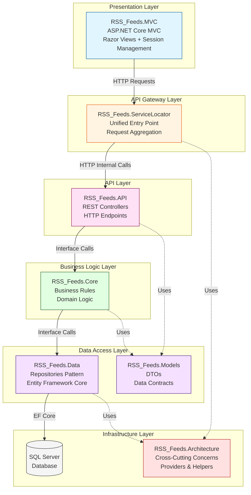
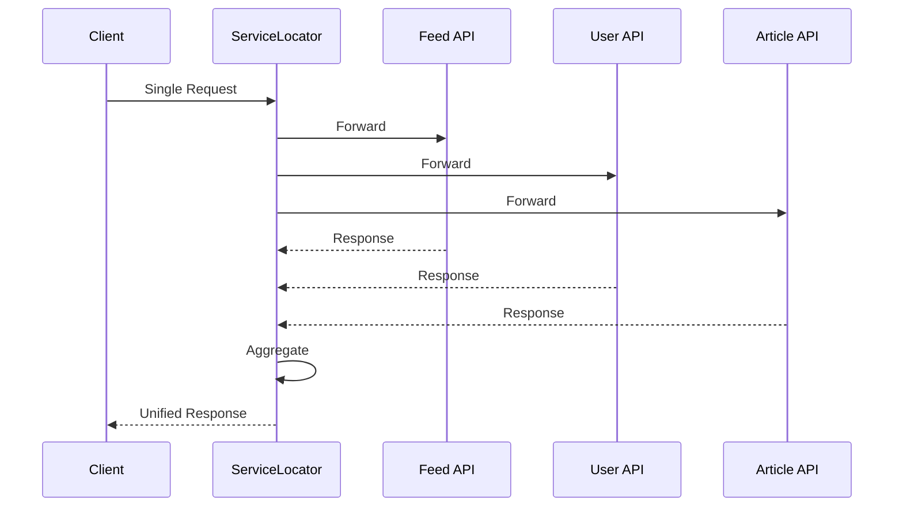
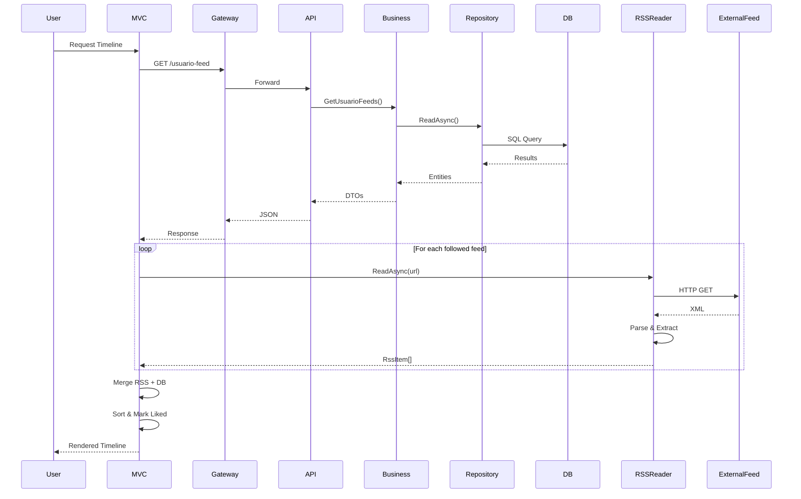

# 📰 RSS Feeds Aggregator

<div align="center">


**Una aplicación agregadora de feeds RSS construida con .NET 8.0 que demuestra arquitectura empresarial, patrones de diseño avanzados y mejores prácticas de la industria.**

[Características](#-características) • [Arquitectura](#-arquitectura) • [Tecnologías](#-tecnologías) • [Patrones de Diseño](#-patrones-de-diseño) • [Instalación](#-instalación)

</div>

---

## 🎯 Descripción

**RSS Feeds** es una aplicación web completa para agregar y gestionar feeds RSS. Permite a los usuarios seguir múltiples fuentes, visualizar un timeline personalizado, y guardar artículos para lectura posterior.

El proyecto está construido siguiendo una **arquitectura en capas** con separación estricta de responsabilidades, implementando múltiples **patrones de diseño** y **principios SOLID**, demostrando un dominio sólido de **.NET Core 8.0** y arquitectura de software empresarial.

---

## ✨ Características

- ✅ **Gestión de Feeds RSS**: Descubre y sigue múltiples feeds RSS personalizados
- ✅ **Timeline Personalizado**: Visualiza artículos de todos tus feeds seguidos en un solo lugar
- ✅ **Sistema de Guardados**: Marca artículos favoritos para leer después
- ✅ **Lectura RSS en Tiempo Real**: Los feeds se leen directamente desde la fuente en cada carga
- ✅ **Parsing Avanzado**: Extrae imágenes de múltiples formatos RSS (enclosure, media:content, media:thumbnail, HTML)
- ✅ **Autenticación por Sesión**: Sistema de login/registro con sesiones del servidor
- ✅ **Interfaz Moderna**: UI responsive con diseño minimalista

---

## 🏛️ Arquitectura

El proyecto implementa una **Arquitectura en Capas (Layered Architecture)** con 7 proyectos independientes, siguiendo principios de **Clean Architecture** y **Domain-Driven Design**.

### Diagrama de Arquitectura



### Estructura del Proyecto

```
RSS_Feeds/
├── RSS_Feeds.MVC/                    # Presentation Layer (Frontend)
├── RSS_Feeds.ServiceLocator/         # API Gateway (Unified Entry Point)
├── RSS_Feeds.API/                    # API Layer (REST Endpoints)
├── RSS_Feeds.Core/                   # Business Logic Layer
├── RSS_Feeds.Data/                   # Data Access Layer (Repositories + EF Core)
├── RSS_Feeds.Models/                 # DTOs Layer (Data Transfer Objects)
└── RSS_Feeds.Architecture/           # Infrastructure (Cross-cutting Concerns)
```

### Decisiones Arquitectónicas

| Decisión | Razón |
|----------|-------|
| **7 Proyectos Separados** | Independencia de despliegue, mantenibilidad, testabilidad |
| **API Gateway Pattern** | Simplifica cliente, abstrae complejidad, punto único para cross-cutting concerns |
| **Repository Pattern** | Abstrae acceso a datos, facilita testing, permite cambiar ORM |
| **Business Logic Layer** | Separación de concerns, reglas de negocio aisladas |
| **DTO Pattern** | Control de exposición de datos, evita serialización cíclica |

---

## 🛠️ Tecnologías

### Stack Principal

- **.NET 8.0** - Framework principal
- **ASP.NET Core 8.0** - Framework web
- **Entity Framework Core 8.0** - ORM para acceso a datos
- **SQL Server** - Base de datos relacional
- **C# 12** - Lenguaje de programación

### Características de .NET 8.0 Utilizadas

#### ✨ Primary Constructors (C# 12)
Simplifica la inyección de dependencias:

```csharp
public class FeedBusiness(IRepositoryFeed repo) : IFeedBusiness
{
    private readonly IRepositoryFeed _repo = repo;
    // ...
}
```

#### ✨ Nullable Reference Types
Type safety mejorado para prevenir errores de null:

```csharp
public string? Descripcion { get; set; } // Puede ser null
public string Titulo { get; set; } // No puede ser null
```

#### ✨ Minimal API Configuration
Configuración simplificada sin `Startup.cs`:

```csharp
var builder = WebApplication.CreateBuilder(args);
// Configuración...
var app = builder.Build();
// Pipeline...
```

#### ✨ HttpClient Factory Pattern
Gestión eficiente de conexiones HTTP:

```csharp
builder.Services.AddHttpClient("ApiClient", client =>
{
    client.BaseAddress = new Uri("https://localhost:7094/");
});
```

---

## 🎨 Patrones de Diseño

El proyecto implementa múltiples patrones de diseño arquitectónicos y creacionales:

### 1. Repository Pattern

Clase base genérica con especializaciones específicas por entidad:

```csharp
public abstract class RepositoryBase<T> : IRepositoryBase<T> where T : class
{
    protected readonly RssDbContext _context;
    
    public async Task<bool> CreateAsync(T entity)
    {
        await _context.AddAsync(entity);
        return await SaveAsync();
    }
}

public class RepositoryFeed : RepositoryBase<Feed>, IRepositoryFeed
{
    // Operaciones específicas de Feed
}
```

**Beneficio**: Elimina duplicación de código CRUD, mantiene flexibilidad.

### 2. API Gateway Pattern

ServiceLocator actúa como punto de entrada único:



**Beneficio**: Cliente simplificado, agregación de servicios.

### 3. Dependency Injection Pattern

Inyección mediante Primary Constructors y contenedor nativo:

```csharp
// Configuración
builder.Services.AddScoped<IRepositoryFeed, RepositoryFeed>();
builder.Services.AddScoped<IFeedBusiness, FeedBusiness>();

// Uso
public class FeedBusiness(IRepositoryFeed repo) : IFeedBusiness
{
    // ...
}
```

**Beneficio**: Desacoplamiento total, facilita testing.

### 4. DTO Pattern

Separación entre modelo de dominio y modelo de transferencia:

```csharp
// Entidad interna
public class Feed { /* Con propiedades de navegación EF */ }

// DTO externa
public class FeedDTO { /* Sin propiedades de navegación */ }
```

**Beneficio**: Control de exposición, evita serialización cíclica.

### 5. Service Layer Pattern

Dos niveles: Business Services (Core) y Application Services (ServiceLocator).

### 6. Provider Pattern

Abstracción de operaciones técnicas (HTTP, JSON):

```csharp
public interface IRestProvider
{
    Task<string> GetAsync(string endpoint, string? id);
    Task<string> PostAsync(string endpoint, string content);
}
```

---

## 🔄 Flujo de Datos Complejo

### Ejemplo: Flujo del Timeline

El timeline demuestra la complejidad de orquestar múltiples fuentes:



**Desafíos Resueltos**:
- ✅ Combina múltiples fuentes de datos (BD + RSS externos)
- ✅ Parsing complejo de múltiples formatos RSS
- ✅ Manejo de errores sin interrumpir el proceso
- ✅ Lectura asíncrona paralela para performance
- ✅ Deduplicación inteligente por URL

---

## ✅ Principios SOLID Aplicados

| Principio | Implementación |
|-----------|----------------|
| **S**ingle Responsibility | Cada clase tiene una única responsabilidad (Repository, Business, Controller) |
| **O**pen/Closed | Extensible mediante herencia e interfaces sin modificar código existente |
| **L**iskov Substitution | Implementaciones sustituibles por sus interfaces |
| **I**nterface Segregation | Interfaces específicas y cohesivas |
| **D**ependency Inversion | Dependencias hacia abstracciones, no implementaciones |

---

## 🚀 Instalación

### Prerequisitos

- [.NET SDK 8.0](https://dotnet.microsoft.com/download/dotnet/8.0) o superior
- [SQL Server](https://www.microsoft.com/sql-server/sql-server-downloads) (Express o superior)
- [Visual Studio 2022](https://visualstudio.microsoft.com/) o [VS Code](https://code.visualstudio.com/)

### Pasos de Instalación

1. **Clonar el repositorio**
   ```bash
   git clone https://github.com/tu-usuario/RSS_Feeds.git
   cd RSS_Feeds
   ```

2. **Configurar Base de Datos**
   - Actualizar connection string en `RSS_Feeds.API/appsettings.json`:
   ```json
   {
     "ConnectionStrings": {
       "DefaultConnection": "Server=TU_SERVIDOR;Database=rss_app;Trusted_Connection=True;TrustServerCertificate=True;"
     }
   }
   ```
   - Ejecutar migraciones de Entity Framework (si aplica)

3. **Ejecutar APIs**
   ```bash
   # Terminal 1: API
   cd RSS_Feeds.API
   dotnet run
   # Se ejecuta en https://localhost:7070
   
   # Terminal 2: ServiceLocator (API Gateway)
   cd RSS_Feeds.ServiceLocator
   dotnet run
   # Se ejecuta en https://localhost:7094
   ```

4. **Ejecutar Frontend**
   ```bash
   # Terminal 3: MVC
   cd RSS_Feeds.MVC
   dotnet run
   ```

5. **Acceder a la aplicación**
   - Frontend MVC: `https://localhost:XXXX` (puerto configurado)
   - API ServiceLocator: `https://localhost:7094/api/ServiceLocator`
   - Swagger (Development): Disponible en ambos proyectos API

---

## 📊 Estructura de Base de Datos

### Entidades Principales

- **Usuario**: Usuarios del sistema
- **Feed**: Feeds RSS disponibles
- **Articulo**: Artículos de los feeds
- **UsuarioFeed**: Relación usuario-feed (suscripciones)
- **UsuarioArticulosGuardado**: Artículos guardados por usuario

### Relaciones

```
Usuario 1───N UsuarioFeed N───1 Feed
Usuario 1───N UsuarioArticulosGuardado N───1 Articulo
Feed 1───N Articulo
```

---

## 🧪 Testing

El proyecto está diseñado para ser fácilmente testeable mediante:

- **Mock de Repositorios**: Interfaces permiten fácil creación de mocks
- **Dependency Injection**: Facilita inyección de dependencias de prueba
- **Separación de Concerns**: Cada capa testeable independientemente

**Ejemplo de test unitario** (estructura recomendada):
```csharp
[Fact]
public async Task GetFeeds_ShouldReturnAllFeeds()
{
    // Arrange
    var mockRepo = new Mock<IRepositoryFeed>();
    mockRepo.Setup(r => r.ReadAsync()).ReturnsAsync(fakeFeeds);
    var business = new FeedBusiness(mockRepo.Object);
    
    // Act
    var result = await business.GetAsync();
    
    // Assert
    Assert.Equal(fakeFeeds.Count(), result.Count());
}
```

---

## 📈 Características Avanzadas

### Parsing RSS Avanzado

Extrae imágenes de múltiples formatos:
- Enclosure con `type="image"`
- `media:content` (Yahoo Media RSS)
- `media:thumbnail` (BBC, CNN)
- Etiquetas `` en HTML de descripción/contenido

### Manejo de Errores

- **Por capa**: Estrategia estructurada de manejo de errores
- **HTTP Status Codes**: Códigos apropiados en API Layer
- **Tolerancia a fallos**: Si un feed RSS falla, continúa con los demás

### Performance

- **Async/Await**: Todas las operaciones I/O son asíncronas
- **Lectura paralela**: Múltiples feeds RSS leídos en paralelo
- **Caching implícito**: Entity Framework caching de queries

---

## 🎓 Conocimientos Demostrados

### .NET Core 8.0
- ✅ Primary Constructors (C# 12)
- ✅ Nullable Reference Types
- ✅ Minimal API Configuration
- ✅ Dependency Injection avanzado
- ✅ HttpClient Factory Pattern
- ✅ Entity Framework Core Code-First
- ✅ ASP.NET Core Sessions
- ✅ Middleware Pipeline Configuration

### Arquitectura de Software
- ✅ Layered Architecture
- ✅ Clean Architecture Principles
- ✅ Separation of Concerns
- ✅ Dependency Inversion
- ✅ API Gateway Pattern

### Patrones de Diseño
- ✅ Repository Pattern
- ✅ Service Layer Pattern
- ✅ DTO Pattern
- ✅ Provider Pattern
- ✅ Dependency Injection
- ✅ Template Method Pattern

### Principios SOLID
- ✅ Todos los principios aplicados correctamente

---

## 🔧 Configuración

### Puertos por Defecto

| Aplicación | Puerto HTTPS | URL Base |
|-----------|--------------|----------|
| RSS_Feeds.API | 7070 | `https://localhost:7070` |
| RSS_Feeds.ServiceLocator | 7094 | `https://localhost:7094` |
| RSS_Feeds.MVC | Variable | `https://localhost:XXXX` |

### Archivos de Configuración

- `RSS_Feeds.API/appsettings.json` - Connection string de base de datos
- `RSS_Feeds.ServiceLocator/appsettings.json` - URLs de APIs internas
- `RSS_Feeds.MVC/appsettings.json` - Configuración del frontend

---

## 📝 Notas de Desarrollo

### Agregar un Nuevo Endpoint

1. **API Layer**: Agregar método en controlador
2. **Business Layer**: Agregar lógica en `RSS_Feeds.Core/BusinessLogic/`
3. **Repository Layer**: Agregar método si es necesario
4. **ServiceLocator**: Agregar servicio y exponer en `ServiceLocatorController`
5. **MVC**: Si necesita UI, agregar controlador y vista

### Agregar una Nueva Entidad

1. Crear entidad en `RSS_Feeds.Data/Models/`
2. Agregar `DbSet` en `RssDbContext`
3. Crear migración: `dotnet ef migrations add NombreMigracion`
4. Crear repositorio en `RSS_Feeds.Data/Repositories/`
5. Crear business logic en `RSS_Feeds.Core/BusinessLogic/`
6. Crear DTO en `RSS_Feeds.Models/DTOs/`
7. Crear controlador API
8. Crear servicio en ServiceLocator
9. Exponer en ServiceLocatorController

---

## 🤝 Contribuir

Las contribuciones son bienvenidas. Por favor:

1. Fork el proyecto
2. Crea una rama para tu feature (`git checkout -b feature/AmazingFeature`)
3. Commit tus cambios (`git commit -m 'Add some AmazingFeature'`)
4. Push a la rama (`git push origin feature/AmazingFeature`)
5. Abre un Pull Request

---

## 📄 Licencia

Este proyecto está bajo la Licencia MIT. Ver el archivo `LICENSE` para más detalles.

---

## 👤 Autor

**Tu Nombre**

- GitHub: [@tu-usuario](https://github.com/tu-usuario)
- LinkedIn: [Tu Perfil](https://linkedin.com/in/tu-perfil)

---

## 🙏 Agradecimientos

- .NET Team por el excelente framework
- Comunidad de desarrolladores .NET
- Todos los contribuidores y revisores

---

<div align="center">

**⭐ Si te gustó este proyecto, dale una estrella ⭐**

Hecho con ❤️ usando .NET 8.0

</div>

